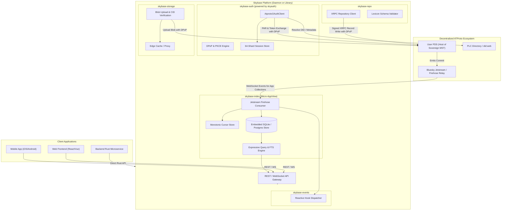
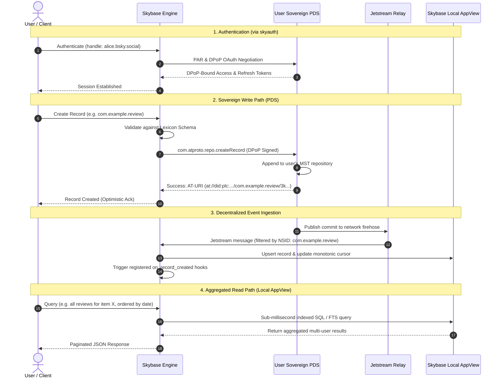

# 📄 Product Requirements Document (PRD)

# `skybase`
### The Open-Source Backend & Developer Platform for the AT Protocol ("Firebase for ATProto")

---

## 1. Executive Summary & Problem Statement

### 1.1 Context: The Decentralized Application Dilemma
In traditional Web2 architectures (Google Firebase, Supabase, AWS Amplify), developing an application backend is streamlined:
1. **Centralized Database**: Developers write to and read from a single database (Firestore, PostgreSQL) hosted by the application.
2. **Custodial Authentication**: Authentication is simple (OAuth, passwords) and grants permissions directly to the central database.
3. **Synchronous Writes & Reads**: When a user creates a record, it is written directly to the database and is immediately queryable across all users.
4. **Centralized Storage & Cloud Functions**: Blobs are uploaded to an S3/GCS bucket; event hooks trigger functions directly off database write streams.

In the **AT Protocol (ATProto)**, this mental model is inverted:
- **Sovereign User Repositories (MSTs)**: Users own their data. Every post, like, comment, game move, or custom record resides in the user's personal repository (a signed Merkle Search Tree) hosted on their sovereign **Personal Data Server (PDS)**. Applications *do not and cannot* own user data.
- **The Micro-AppView Requirement**: Because user data is distributed across thousands of independent PDS instances, an application cannot query individual PDSs in real-time to render an aggregated feed, comments list, or search index. The application **must run an AppView** — an ingestion and indexing engine that consumes the global firehose, filters relevant collection records, and maintains an aggregated queryable index.
- **Authentication Complexity**: App passwords are deprecated for public apps. ATProto mandates **OAuth 2.1 with RFC 9449 DPoP (Demonstrating Proof-of-Possession)**, **RFC 9126 PAR (Pushed Authorization Requests)**, **RFC 7636 PKCE**, decentralized identity discovery (`did:plc`, `did:web`, DNS TXT, `.well-known`), and strict SSRF defenses.
- **Firehose Ingestion Scalability**: Consuming the ATProto firehose or Jetstream requires managing WebSocket connections, backpressure, cursor persistence, sequence reordering, and schema deserialization.

### 1.2 The Ecosystem Problem
Currently, developers wanting to build an application on ATProto face a massive barrier to entry. They must individually implement:
- Complex OAuth 2.1 + DPoP token negotiation and storage.
- Custom WebSocket consumers for Jetstream or the firehose.
- Custom relational databases or search indexes to aggregate cross-user records.
- Blob upload pipelines with CID computation and media caching.
- Event dispatchers and background task schedulers.

As highlighted in the Bluesky ecosystem discussion between developers:
> *"the highest-leverage thing we can do to grow atproto right now is make it easier for devs to build apps on... 'firebase for atproto' is a good target."*

### 1.3 The Solution: `skybase`
`skybase` is an open-source, `#![forbid(unsafe_code)]` pure Safe Rust backend framework, standalone daemon, and client SDK suite that brings the developer ergonomics of Firebase/Supabase to the AT Protocol.

Powered by [`skyauth`] for cryptographic identity and authentication, `skybase` provides:
1. **`skybase-auth`**: Turn-key decentralized OAuth 2.1, DPoP session lifecycle, and web framework middleware.
2. **`skybase-repo`**: Ergonomic sovereign repository CRUD engine with compile-time and runtime Lexicon validation. Records are written directly to user PDSs with cryptographic signatures.
3. **`skybase-index`**: Embedded Micro-AppView engine. Filters the Jetstream/firehose for specified collection NSIDs, replicating matching records into an embedded high-concurrency database (SQLite WAL / Turso / Postgres) with full-text search and secondary indexes.
4. **`skybase-events`**: Reactive triggers and webhooks (`on_record_created`, `on_record_deleted`) with durable cursor resumption and backpressure defense.
5. **`skybase-storage`**: Sovereign blob management. Uploads blobs to user PDS with CID verification, magic byte validation, and optional edge-cached CDN proxying.
6. **`skybase-server` (Standalone Daemon)**: Single-binary executable (PocketBase-style) providing a unified REST and WebSocket API, complete with an embedded Web Admin dashboard.
7. **Client SDKs**: Idiomatic Rust crate + TypeScript / JavaScript client library for React, React Native, Next.js, and mobile platforms.

---

## 2. Core Vision & Design Principles

### 2.1 Reference Blueprint & Standards
`skybase` is designed and implemented following the **Production-Grade Rust Best Practices & Architecture Standards** defined in the reference repository:
- **Reference Repo**: [`rust-best-practices`](/Users/mike10010100/git/rust-best-practices)
- **Architecture Guide**: [`BEST_PRACTICES.md`](/Users/mike10010100/git/rust-best-practices/BEST_PRACTICES.md)
- **Tooling Blueprint**: [`TOOLING.md`](/Users/mike10010100/git/rust-best-practices/TOOLING.md)
- **Agent Blueprint**: [`agents.md`](/Users/mike10010100/git/rust-best-practices/agents.md)
- **Sibling Ecosystem**: [`skyauth`](../skyauth) and [`for-your-consideration`](../for-your-consideration)

### 2.2 Core Non-Negotiable Invariants
1. **100% Pure Safe Rust (`#![forbid(unsafe_code)]`)**:
   - Zero `unsafe` blocks in crate roots ([`src/lib.rs`](src/lib.rs)) or sub-modules. No dependencies that circumvent compiler safety guarantees.
2. **Strict Crate-Root Safety Guard**:
   - Enforced compiler lints:
     ```rust
     #![deny(
         clippy::all,
         clippy::unwrap_used,     // Deny unwrap(), force explicit error handling
         clippy::expect_used,     // Deny expect(), force structured errors
         clippy::panic,           // Deny panic!, force error bubbling
         clippy::todo,            // Deny todo! placeholders in production
         clippy::unimplemented,   // Deny unimplemented! macros
         missing_docs,            // Enforce public API documentation
         rust_2018_idioms         // Use modern Rust idioms
     )]
     ```
3. **Zero Production Panics & Typed Errors**:
   - Deny `.unwrap()`, `.expect()`, `panic!`, `todo!`, and `unimplemented!` in production paths. All fallible operations return strongly typed `Result<T, SkybaseError>` using variants in [`src/error.rs`](src/error.rs).
4. **User Sovereignty by Default**:
   - `skybase` never takes custodial ownership of user data. All records are written directly to the user's sovereign PDS repository. The local `skybase-index` is an ephemeral, rebuildable read projection (AppView), never a custodial walled garden.
5. **Defensive Concurrency & 64-Shard Partitioning**:
   - High-concurrency state structures (session caches, subscription tables, memory indexes) use **64 independent `RwLock` shards** to eliminate lock contention under multi-threaded load.
   - **Never Hold Locks Across `.await` Points**: Synchronous mutex or `RwLock` guards must always be dropped before executing any `.await`, `sleep()`, or network I/O.
6. **Clock-Warp Safety & Drift-Free Scheduling**:
   - Elapsed time is always computed using `now.saturating_duration_since(earlier)` or `.map_or(0, ...)` to guarantee resilience against backwards monotonic clock jumps during VM migrations or NTP syncs.
   - Recurring tasks (Jetstream cursor commits, cache evictions, token renewals) must calculate next runs relative to the previous anchor timestamp or use `tokio::time::interval`, not relative `Instant::now() + delay`.
7. **Task Leak Prevention & Managed Cancellation**:
   - All background tasks (firehose ingestion, event dispatching, health checkers) are tracked in a managed `tokio::task::JoinSet` tied to a `tokio_util::sync::CancellationToken`. On shutdown or timeout, tasks are cleanly aborted and joined.
8. **100% Documentation Coverage**:
   - All public structs, fields, constants, enums, modules, and functions must have descriptive documentation comments (`missing_docs` is denied). Bare URLs in documentation must be enclosed in angle brackets (e.g. `<https://bsky.social>`).
### 2.3 Strategic Architecture: The "Engine vs. Interface" Mandate (Avoiding the Language Trap)
A critical strategic question for `skybase` is: *Are we pigeonholing ourselves by building in Rust?*

The answer is: **Only if we force developers to write Rust to use it.**

#### The Market Reality
- In the AT Protocol ecosystem, **85–90%** of application developers write **TypeScript / JavaScript (React, React Native, Next.js), Swift (iOS), Kotlin (Android), or Flutter**.
- Only **10–15%** are systems/backend engineers writing Rust or Go.
- If `skybase` were *only* an embeddable Rust crate requiring developers to install `cargo` and write Rust code to build their app, the project would artificially restrict its addressable market to a tiny fraction of builders.

#### The "PocketBase / Supabase / Meilisearch" Playbook
The most successful modern developer platforms solve this by separating the **Engine** from the **Interface**:
- **PocketBase** is written 100% in Go, but 90% of its users write JavaScript and Dart.
- **Supabase** is written in Elixir, Go, and C (Postgres), but its developers write TypeScript and Python.
- **Meilisearch** is written 100% in Rust, but frontend developers consume it via simple npm packages.
- **Firebase** is written in C++, Java, and Go, but developers interact exclusively through JavaScript, Swift, and Kotlin SDKs.

**Rust is an invisible superpower for the engine, not a barrier for the developer.**
- **Firehose Ingestion Scale**: Processing the global Jetstream firehose requires sustaining 5,000–10,000+ events/sec without garbage collection pauses or thread starvation. In Rust, `skybase` achieves this on a $5/month VPS using under 50MB of RAM.
- **Single Zero-Dependency Binary**: Developers download one 15MB static executable (`./skybase`). No Node.js runtime conflicts, no native C++ node-gyp compilation failures, and no mandatory Docker setup.
- **Formally Verified Cryptographic Kernel**: Pure Safe Rust (`#![forbid(unsafe_code)]`) with zero memory corruption, leveraging [`skyauth`]'s formally proven DPoP, PKCE, and SSRF filters.

#### The Three Golden Rules to Avoid Pigeonholing
To ensure `skybase` captures the entire developer ecosystem, the project strictly enforces three architectural rules:

1. **Rule 1: The Primary Interface is HTTP / WebSocket + First-Class TypeScript SDK (`@skybase/client`)**
   - 90% of developers will interact with `skybase` via TypeScript/JavaScript:
     ```typescript
     import { Skybase } from '@skybase/client';
     const sb = new Skybase('http://localhost:8080');
     await sb.auth.signInWithHandle('alice.bsky.social');
     const post = await sb.collection('app.bsky.feed.post').create({ text: 'Hello!' });
     sb.collection('app.bsky.feed.post').where('author', '==', 'alice.bsky.social').onSnapshot(setPosts);
     ```
   - The developer experience feels identical to Firebase; the developer never knows or cares that Rust powers the engine.

2. **Rule 2: Zero-Install Local Developer Experience (No Rust Toolchain Required)**
   - Frontend developers can launch a local backend without installing Rust or Cargo:
     ```bash
     npx skybase dev
     # or
     brew install skybase && skybase
     # or
     docker run -p 8080:8080 skybase/skybase
     ```
   - The single binary boots in under 10 milliseconds, initializes SQLite, starts the API gateway, and serves the embedded Web Admin dashboard.

3. **Rule 3: Extensibility Without Recompilation (Webhooks & Scripting)**
   - In Firebase, developers write Cloud Functions in TypeScript. If `skybase` required recompiling Rust to add an event trigger, it would alienate non-Rust developers.
   - `skybase` resolves this via:
     - **HTTP Webhooks**: Dispatches HTTP POST notifications to any external server (e.g. Next.js `/api/webhooks/*` or AWS Lambda) when record mutations occur.
     - **Embedded Scripting (Phase 3/4)**: Lightweight embedded JavaScript (via QuickJS / Boa) or WASM plugins for running server-side triggers directly inside the daemon.
     - **Native Rust Crate**: Remains available as a direct compile-time dependency for high-performance systems developers (feed generators, custom relays, and firehose indexers).

## 3. Deep Architectural Review: What Firebase Actually Does vs. The ATProto Reality

To build an authentic "Firebase for the AT Protocol", we must rigorously deconstruct what Firebase does, why developers rely on it, the fundamental architectural conflict posed by decentralized ATProto, and how `skybase` resolves each challenge in pure Safe Rust.

```text
┌────────────────────────────────────────────────────────────────────────────────────────┐
│                              WHAT FIREBASE ACTUALLY DOES                              │
├────────────────────┬───────────────────────────────────────────────────────────────────┤
│ 1. Identity & Auth │ Firebase Auth: User directory, social OAuth, JWT sessions         │
│ 2. Data Storage    │ Firestore: NoSQL document store, compound queries, collections    │
│ 3. Realtime Sync   │ onSnapshot(): Persistent WebSocket push updates down to clients   │
│ 4. Offline First   │ Optimistic UI updates, local cache, background sync on reconnect  │
│ 5. Blob / Media    │ Cloud Storage: Direct client upload to GCS, signed URLs, CDN      │
│ 6. Logic / Triggers│ Cloud Functions: Serverless handlers on DB writes, Auth, Crons   │
│ 7. Access Rules    │ Security Rules: Declarative authorization (request.auth.uid)      │
│ 8. Local Emulator  │ Emulator Suite & Console: Local offline testing + Web Dashboard   │
└────────────────────┴───────────────────────────────────────────────────────────────────┘
```

### 3.1 Pillar 1: Identity & Authentication (Firebase Auth)
* **What Firebase Does**: Manages user accounts, passwords, phone/SMS OTP, social logins (Google, Apple, GitHub), anonymous sessions, and issues signed JWT ID tokens with automatic background refresh.
* **Why Developers Rely on It**: Eliminates the danger and complexity of password hashing, salt storage, OAuth 2.0 PKCE redirection flows, and session validation.
* **The ATProto Conflict**: In Web2, user credentials and identity records live in Google's cloud database. In ATProto, **users possess sovereign decentralized identifiers** (`did:plc`, `did:web`). Authentication must not be custodial; apps must support decentralized **OAuth 2.1 with RFC 9449 DPoP (proof-of-possession binding tokens to ephemeral client keys)**, RFC 9126 PAR, and bidirectional handle resolution (`alsoKnownAs`).
* **The `skybase` Solution (`skybase-auth`)**: Built directly on [`skyauth`]. Provides an ergonomic one-liner authentication API:
  - Generates ephemeral ECDSA P-256 keys and computes RFC 7638 JWK thumbprints (`jkt`).
  - Resolves handles via DNS TXT and HTTPS `.well-known` endpoints with strict SSRF boundaries.
  - Automatically negotiates DPoP nonces and handles code exchange.
  - Partitions active sessions across 64 lock-free `RwLock` shards with secure token zeroization on drop.

### 3.2 Pillar 2: Data Storage & Compound Indexing (Cloud Firestore)
* **What Firebase Does**: A hierarchical NoSQL document store (Collections $\rightarrow$ Documents). Provides sub-second compound queries (`.where("tag", "==", "rust").where("rating", ">=", 4).orderBy("created_at", "desc").limit(20)`) and automated index management.
* **Why Developers Rely on It**: Fast, schemaless development with zero SQL schema migration overhead.
* **The ATProto Conflict (The Sovereignty vs. Aggregation Paradox)**:
  - In Firebase, all users write to one centralized database hosted by the developer.
  - In ATProto, **users own their data in their personal PDS repository (an MST)**. If 50,000 users use an app, their records live on 50,000 different PDS instances.
  - An app *cannot* query 50,000 remote PDS instances in real time to render an aggregated feed, comments list, or search index.
* **The `skybase` Solution (`skybase-repo` + `skybase-index`)**: Resolves the paradox with a **Dual-Path Engine**:
  - **Sovereign Write Path (`skybase-repo`)**: Client writes are signed with DPoP and submitted via XRPC (`com.atproto.repo.createRecord`) directly to the user's personal PDS. The user retains complete custody of their data.
  - **Aggregated Read Path (`skybase-index`)**: An embedded **Micro-AppView** connects to the global Jetstream firehose, filters exclusively for the app's collection NSIDs (e.g. `com.myapp.review`), and replicates commits into an embedded SQLite WAL database with full-text search (FTS5) and compound secondary indexes.

### 3.3 Pillar 3: Real-Time Push Synchronization (`onSnapshot`)
* **What Firebase Does**: Keeps client state synchronized in real time via persistent WebSockets. Whenever a document or query result changes, Firebase computes the diff and pushes updates immediately to all listening clients without polling.
* **Why Developers Rely on It**: Enables live chats, real-time dashboards, multiplayer games, and collaborative tools out of the box.
* **The ATProto Conflict**: ATProto does not have a centralized push broker for arbitrary application records.
* **The `skybase` Solution (`skybase-events`)**: In ATProto, the global firehose (Jetstream) *is* the change-data-capture stream. When any user's PDS commits a record, Jetstream broadcasts the event. `skybase-events` intercepts matching events, updates the local SQLite index, and pushes real-time diffs down WebSocket connections to listening client SDKs, recreating the beloved `.onSnapshot()` developer experience.

### 3.4 Pillar 4: Offline Persistence & Optimistic UI Mutations
* **What Firebase Does**: Maintains a local client-side cache (IndexedDB in the browser, SQLite on mobile). Reads are served from cache; writes immediately update the UI (optimistic update), are queued locally, and sync to the server when network connectivity is restored.
* **Why Developers Rely on It**: Zero-latency UI response and seamless offline mobile resilience.
* **The ATProto Conflict**: ATProto records require cryptographic CIDs and sequence commit hashes from the user's remote PDS.
* **The `skybase` Solution**: `skybase` leverages ATProto TID (Timestamp Identifier) generation. Record keys are deterministically generated on the client, enabling instant optimistic rendering in the local cache. The client SDK queues the DPoP-signed XRPC write and synchronizes with the user's PDS upon reconnection.

### 3.5 Pillar 5: Asset & Blob Storage (Cloud Storage for Firebase)
* **What Firebase Does**: Object storage backed by Google Cloud Storage (GCS). Allows direct-from-client uploads with progress monitoring, resumable transfers, signed download URLs, and global CDN delivery.
* **Why Developers Rely on It**: Avoids proxying large binary media files through application servers.
* **The ATProto Conflict**: ATProto supports blob storage on each PDS (`com.atproto.repo.uploadBlob`), where blobs are content-addressed using cryptographic CIDs (SHA-256 multihash) and referenced inside records via `$type: "blob"`. However, PDSs have strict storage quotas, and serving viral media directly from a user's home PDS causes severe bandwidth throttling.
* **The `skybase` Solution (`skybase-storage`)**:
  - Validates file headers, magic bytes, and MIME types to prevent malicious uploads.
  - Computes the SHA-256 multihash and ATProto CID before transmission.
  - Uploads the blob to the user's sovereign PDS with DPoP credentials.
  - Optionally mirrors the blob into a local disk LRU or Cloudflare R2 / AWS S3 edge cache to shield user PDSs from high-volume read traffic.

### 3.6 Pillar 6: Serverless Event Triggers (Cloud Functions)
* **What Firebase Does**: Automatically executes backend functions in response to database writes (`onDocumentCreated`), auth changes (`onUserCreated`), storage uploads, or cron schedules (`onSchedule`).
* **Why Developers Rely on It**: Decouples asynchronous background tasks (calculating scores, sending notifications, aggregating metrics) from frontend client requests.
* **The ATProto Conflict**: App backends must react to decentralized commits broadcast over the global firehose.
* **The `skybase` Solution (`skybase-events`)**: Provides declarative in-process asynchronous Rust event hooks:
  ```rust
  skybase.events().on_create("com.example.review", |event| async move {
      recalculate_aggregate_rating(&event.record.item_id).await?;
      Ok(())
  });
  ```
  Backed by a durable monotonic sequence cursor persisted to disk, ensuring zero dropped events across server restarts.

### 3.7 Pillar 7: Declarative Security & Access Rules (Firebase Security Rules)
* **What Firebase Does**: Evaluates a declarative domain-specific rule language on every database and storage request (`allow write: if request.auth.uid == resource.data.authorId`).
* **Why Developers Rely on It**: Enforces authorization and schema constraints directly at the data layer, eliminating boiler-plate CRUD controller endpoints.
* **The ATProto Conflict**: Security in ATProto is cryptographic. A PDS will only commit records signed by the private key belonging to that user's DID document. On the AppView side, the indexer must verify that incoming firehose records were genuinely authored by the claiming DID.
* **The `skybase` Solution (`skybase-rules`)**: Validates commit signatures against the author's public key extracted from their DID document, verifies author DID ownership, and enforces strict schema validation against bundled ATProto Lexicons.

### 3.8 Pillar 8: Local Emulator Suite & Web Admin Console
* **What Firebase Does**: Running `firebase emulators:start` spins up local emulators of Auth, Firestore, and Functions on `localhost`, paired with a browser-based Admin Console for inspecting records, users, and logs.
* **Why Developers Rely on It**: Fast, hermetic local development and automated CI testing without cloud bills or network dependencies.
* **The ATProto Conflict**: Setting up a local ATProto dev environment typically requires running a local PDS, a local BGS relay, a PLC directory mock, and an OAuth authorization server — a massive barrier for developers.
* **The `skybase` Solution (`skybase-server`)**: A single, zero-dependency binary executable (PocketBase-style). Running `./skybase-server` spins up:
  - Embedded SQLite database engine.
  - Local REST and WebSocket API gateway.
  - Ingestion consumer with mock PDS and mock Jetstream test modes.
  - Embedded Web Admin dashboard (bundled directly into the binary via `rust-embed`) allowing developers to explore collections, inspect firehose lag, and test queries in real time.

---

## 4. Scope & Feature Matrix

| Firebase Feature | `skybase` Pillar | Underlying ATProto / Standards Mechanism |
| :--- | :--- | :--- |
| **Firebase Auth** | `skybase-auth` | Powered by `skyauth`: OAuth 2.1, RFC 9449 DPoP, RFC 9126 PAR, RFC 7636 PKCE, DID/Handle resolution, SSRF boundaries. |
| **Cloud Firestore (Write)** | `skybase-repo` | Direct XRPC writes (`com.atproto.repo.putRecord`, `createRecord`, `applyWrites`) signed into user's PDS MST repository. |
| **Cloud Firestore (Read/Query)** | `skybase-index` | Embedded Micro-AppView engine. Ingests Jetstream firehose for target NSIDs into SQLite WAL / Postgres; provides relational, indexed, and full-text queries. |
| **Realtime Subscriptions** | `skybase-events` | WebSocket live-query streams and reactive function hooks triggered off Jetstream record commits with durable cursor tracking. |
| **Cloud Storage** | `skybase-storage` | PDS blob upload (`com.atproto.repo.uploadBlob`), SHA-256 CID digest calculation, magic byte validation, and optional S3/R2 edge CDN proxying. |
| **Firebase Security Rules** | `skybase-rules` | Lexicon schema validation, commit signature verification against user DID documents, and author DID access policies. |
| **Local Emulator / Admin** | `skybase-server` | Single-binary daemon with embedded SQLite, REST / WebSocket endpoints, OpenAPI documentation, and Web Admin dashboard. |
| **Client SDKs** | `skybase-sdk` | Ergonomic Rust crate + TypeScript / JavaScript client library (`@skybase/client`) for web and mobile frontends. |

---

## 5. Architectural Blueprint & Data Flow

### 5.1 System Architecture Diagram



### 5.2 The Sovereign Write & Micro-AppView Read Flow



---

## 6. Detailed Component Specifications

### 6.1 `skybase-auth`: Authentication & Identity
Built directly on top of [`skyauth`]:
- **Turn-key Integration**: Wraps `skyauth::client::AtprotoOAuthClient` with higher-level application session lifecycle management.
- **Session Continuity**: Automatic, transparent DPoP access token refresh before expiration.
- **Multi-Tenant State Store**: 64-shard partitioned memory store with configurable Redis or SQL backends for distributed cluster deployments.
- **Framework Middleware**: Ready-to-use extractors and guards for Axum 0.7, Actix-Web 4, and Tower services.
- **Zeroization**: Cryptographic keys and sensitive session tokens are securely scrubbed from memory on drop via `zeroize`.

### 6.2 `skybase-repo`: Sovereign Repository Engine
- **Direct Sovereign Writes**: Issues XRPC calls directly to the user's authoritative PDS using DPoP-signed credentials.
- **Strong Typing & Lexicons**: Generic record definitions `Record<T>` where `T: Serialize + DeserializeOwned`.
- **Atomic Batch Mutations**: Support for `com.atproto.repo.applyWrites` to create, update, and delete multiple records across collections in a single atomic commit.
- **Schema Validation**: Dynamic runtime validation against bundled ATProto Lexicons to prevent malformed records from reaching the PDS.

### 6.3 `skybase-index`: Embedded Micro-AppView
- **Targeted Jetstream Ingestion**: Connects to Bluesky Jetstream (`wss://jetstream1.us-east.bsky.network/subscribe`) requesting only the collection NSIDs used by the application.
- **Zero-Waste Filter**: Drastically reduces network ingress and memory usage compared to consuming the entire uncompressed raw firehose.
- **Embedded Storage**: High-performance SQLite engine configured with Write-Ahead Logging (`PRAGMA journal_mode=WAL`), memory-mapped I/O (`PRAGMA mmap_size`), and synchronous normal mode for concurrent readers and sub-millisecond writes.
- **Expressive Query Builder**:
  ```rust
  let posts = skybase.index()
      .collection("app.bsky.feed.post")
      .filter("reply_parent", Op::IsNull, ())
      .order_by("created_at", Direction::Desc)
      .limit(20)
      .execute::<PostRecord>()
      .await?;
  ```
- **Full-Text Search**: Built-in SQLite FTS5 extension indexing textual content with BM25 ranking.
- **Pluggable SQL Backend**: Optional PostgreSQL backend support for high-throughput enterprise deployments.

### 6.4 `skybase-events`: Reactive Trigger Pipeline
- **Declarative Event Hooks**:
  ```rust
  skybase.events().on_create("com.example.chat.message", |event| async move {
      info!("New chat message from {}: {}", event.did, event.record.text);
      Ok(())
  });
  ```
- **Durable Cursor Persistence**: Ingestion cursor (sequence timestamp in microseconds) is periodically committed to disk. On restart, the engine resumes exactly from the last processed sequence with zero record loss.
- **Backpressure & Bounded Buffers**: Bounded MPSC channels with drop-alerting metrics preventing memory exhaustion during network traffic spikes.

### 6.5 `skybase-storage`: Sovereign Blob Management
- **PDS Blob Upload**: Handles `com.atproto.repo.uploadBlob` with DPoP authentication.
- **Integrity Verification**: Verifies SHA-256 multihash and computes ATProto CID before transmission.
- **MIME & Magic Byte Validation**: Inspects file headers to block malicious executable payloads and ensure format compliance (JPEG, PNG, WebP, MP4, etc.).
- **Edge Cache Proxy**: Optionally caches requested blobs in a local disk LRU or Cloudflare R2 / AWS S3 mirror to protect user PDSs from high-volume read traffic.

### 6.6 `skybase-server`: Standalone Gateway Daemon
- Single binary that launches a complete backend server without writing any Rust code.
- **REST Endpoints**:
  - `POST /api/v1/auth/login`: Initiates OAuth authorization.
  - `GET /api/v1/auth/callback`: Handles OAuth redirect and issues session cookie.
  - `GET /api/v1/collections/{nsid}`: Queries the local Micro-AppView.
  - `POST /api/v1/collections/{nsid}`: Creates a record in the authenticated user's PDS.
  - `DELETE /api/v1/collections/{nsid}/{rkey}`: Deletes a record from the user's PDS.
  - `POST /api/v1/storage/upload`: Uploads a blob to the user's PDS.
- **WebSocket Gateway**: Real-time live queries and subscriptions (`/api/v1/realtime`).
- **Embedded Web Admin Dashboard**: Single-page application bundled directly into the executable via `rust-embed` displaying:
  - Ingestion health, firehose lag, and events/sec.
  - Interactive collection explorer and record editor.
  - Registered OAuth users and active sessions.

---

## 7. Repository Layout & Crate Structure

```
skybase/
├── Cargo.toml                  # Cargo workspace / root package definition
├── LICENSE-MIT                 # MIT License
├── LICENSE-APACHE              # Apache 2.0 License
├── README.md                   # Quickstart, installation, and architectural summary
├── PRD.md                      # This comprehensive Product Requirements Document
├── AGENTS.md                   # Agent handover & Rust best practice invariants
├── src/
│   ├── lib.rs                  # Crate root with #![forbid(unsafe_code)] and core facade
│   ├── error.rs                # Strongly-typed SkybaseError enum
│   ├── config.rs               # SkybaseConfig and builder pattern
│   ├── auth/                   # High-level auth & session management (wrapping skyauth)
│   │   ├── mod.rs
│   │   ├── session.rs          # Managed session lifecycle, auto-refresh, and zeroization
│   │   └── middleware.rs       # Axum / Tower authentication guards
│   ├── repo/                   # Sovereign PDS repository CRUD engine
│   │   ├── mod.rs
│   │   ├── client.rs           # XRPC record creation, update, and deletion
│   │   ├── model.rs            # Generic Record<T>, StrongRef, and CID helpers
│   │   └── lexicon.rs          # Runtime schema validation engine
│   ├── index/                  # Micro-AppView indexing engine
│   │   ├── mod.rs
│   │   ├── engine.rs           # SQLite / PostgreSQL ingestion and query coordinator
│   │   ├── query.rs            # Fluent query builder (filter, order_by, limit)
│   │   ├── schema.rs           # Dynamic table generation and FTS5 indexing
│   │   └── sqlite.rs           # SQLite connection pool with WAL mode optimization
│   ├── events/                 # Reactive event streaming and trigger pipeline
│   │   ├── mod.rs
│   │   ├── jetstream.rs        # High-throughput Jetstream WebSocket subscriber
│   │   ├── cursor.rs           # Monotonic sequence tracker & disk persistence
│   │   └── dispatcher.rs       # In-process asynchronous hook dispatcher
│   ├── storage/                # Blob and media management
│   │   ├── mod.rs
│   │   ├── blob.rs             # PDS uploadBlob client and CID calculation
│   │   └── cache.rs            # Local LRU / S3 edge cache proxy
│   └── server/                 # Optional standalone daemon (feature = "server")
│       ├── mod.rs
│       ├── routes/             # REST API routes (auth, collections, storage)
│       ├── ws.rs               # WebSocket live-query server
│       └── admin.rs            # Embedded Web Admin dashboard assets
├── examples/
│   ├── basic_crud.rs           # Minimal example writing and reading records
│   ├── micro_appview.rs        # Indexing custom collections from Jetstream
│   └── standalone_server.rs    # Running Skybase as an embedded HTTP service
└── tests/
    ├── auth_integration.rs     # Integration tests with mock PDS & skyauth
    ├── repo_crud_tests.rs      # PDS record lifecycle verification
    ├── indexer_tests.rs        # Jetstream ingestion & SQLite query tests
    └── storage_tests.rs        # Blob upload and CID verification tests
```

---

## 8. Developer Experience: Code Examples

### 8.1 Initializing `skybase` and Authenticating (Rust)

```rust
use skybase::{Skybase, SkybaseConfig};

#[tokio::main]
async fn main() -> Result<(), Box<dyn std::error::Error>> {
    // 1. Initialize Skybase with OAuth parameters and Jetstream subscription
    let config = SkybaseConfig::new(
        "https://myapp.com/oauth/client-metadata.json",
        "https://myapp.com/oauth/callback",
        "My ATProto App",
    )
    .with_jetstream_endpoint("wss://jetstream1.us-east.bsky.network/subscribe");

    let skybase = Skybase::new(config)?;

    // 2. Start authorization flow for a user handle
    let auth_request = skybase.auth().authorize("alice.bsky.social").await?;
    println!("Redirect user to: {}", auth_request.authorization_url);

    Ok(())
}
```

### 8.2 Writing a Sovereign Record & Querying the Micro-AppView

```rust
use serde::{Deserialize, Serialize};
use skybase::Skybase;

#[derive(Debug, Serialize, Deserialize)]
struct BookReview {
    title: String,
    rating: u8,
    review_text: String,
    created_at: String,
}

async fn create_and_query_review(
    skybase: &Skybase,
    session: &skybase::auth::Session,
) -> Result<(), Box<dyn std::error::Error>> {
    let review = BookReview {
        title: "Snow Crash".into(),
        rating: 5,
        review_text: "Essential cyberpunk reading.".into(),
        created_at: chrono::Utc::now().to_rfc3339(),
    };

    // 1. Write sovereign record to user's personal PDS repository (signed with DPoP)
    let record_ref = skybase.repo(session)
        .collection("com.example.book.review")
        .create(&review)
        .await?;
    println!("Created record at: {}", record_ref.uri);

    // 2. Query aggregated Micro-AppView across all indexed users
    let top_reviews = skybase.index()
        .collection("com.example.book.review")
        .filter("rating", skybase::index::Op::Gte, 4)
        .order_by("created_at", skybase::index::Direction::Desc)
        .limit(10)
        .execute::<BookReview>()
        .await?;

    for rev in top_reviews {
        println!("Indexed Review: {} (Rating: {})", rev.title, rev.rating);
    }

    Ok(())
}
```

### 8.3 Frontend Client Experience (TypeScript SDK)

```typescript
import { SkybaseClient } from '@skybase/client';

const skybase = new SkybaseClient({
  endpoint: 'https://api.myapp.com',
});

// 1. Sign in with ATProto handle
await skybase.auth.signInWithHandle('alice.bsky.social');

// 2. Write record directly to user's PDS
const post = await skybase.collection('app.bsky.feed.post').create({
  text: 'Hello from Skybase!',
  createdAt: new Date().toISOString(),
});

// 3. Subscribe to real-time live queries
const unsubscribe = skybase.collection('app.bsky.feed.post')
  .filter('replyParent', '==', post.uri)
  .orderBy('createdAt', 'desc')
  .onSnapshot((comments) => {
    console.log('Live comments updated:', comments);
  });
```

---

## 9. Security, Invariants & Architectural Rigor

1. **Zero Unsafe Code & Compiler Lints**:
   - The crate enforces `#![forbid(unsafe_code)]` with zero `unsafe` blocks.
   - Strict compiler lints (`missing_docs`, `clippy::unwrap_used`, `clippy::expect_used`, `clippy::panic`, `clippy::todo`, `clippy::unimplemented`) guarantee compile-time safety and zero panics.
2. **Inherited `skyauth` Security Guarantees**:
   - **Formally Verified Kernels**: SSRF boundary classifiers, constant-time comparisons (`constant_time_eq`), and PKCE byte validators formally proven via Verus and Kani with anti-vacuity gates.
   - **No Shared Secrets**: Public-client DPoP architecture with asymmetric ephemeral ECDSA P-256 keys. No static secrets.
   - **Strict SSRF Boundary**: Hardened egress filters blocking loopback, link-local, RFC 1918, IPv6 ULA, and 6to4/Teredo tunneling prefixes.
3. **Defensive Concurrency & Sharded State Partitioning**:
   - Multi-tenant state caches and firehose subscription maps are partitioned into **64 independent `RwLock` shards** to eliminate lock contention.
   - **Never Hold Locks Across `.await` Points**: Synchronous mutex or `RwLock` guards are strictly dropped before executing any `.await`, `sleep()`, or network I/O.
4. **Clock-Warp Safety & Drift-Free Scheduling**:
   - All elapsed time computations use `now.saturating_duration_since(earlier)` or `.map_or(0, ...)` to safeguard against clock jumps during VM suspension or NTP syncs.
   - Background intervals (cursor persistence, token renewals) run relative to fixed anchor timestamps via `tokio::time::interval`.
5. **Task Leak Prevention & Cancellation**:
   - Background tasks (Jetstream consumer, event dispatcher, cleanup routines) are tracked in a managed `tokio::task::JoinSet` tied to a `tokio_util::sync::CancellationToken`, ensuring clean teardown on shutdown or drop.
6. **Commit Signature Verification & Author Authenticity**:
   - When indexing records from Jetstream, `skybase-rules` verifies that the commit author matches the repository DID and that the commit signature is verified against the author's public signing key in their DID document.
7. **Crash-Resilient Storage & Monotonic Cursors**:
   - Ingestion sequence timestamps are atomic and strictly monotonic.
   - SQLite WAL (Write-Ahead Logging) journaling ensures index consistency without corruption under abrupt power failure.
8. **100% Documentation Coverage**:
   - All public APIs, types, functions, and modules are thoroughly documented. Bare URLs are enclosed in angle brackets (`<https://...>`).

---

## 10. Implementation Roadmap & Milestones

### Phase 1: Foundation & Core Infrastructure (Weeks 1–3)
- [x] Repository initialization (`#![forbid(unsafe_code)]`, strict lints, typed errors).
- [x] Integrate `skyauth` dependency and configure `SkybaseConfig`.
- [x] Establish architectural blueprint and formal `AGENTS.md` guidelines.
- [ ] Implement `skybase-auth` high-level session coordinator and auto-refresh worker.
- [ ] Implement `skybase-repo` XRPC client (`createRecord`, `putRecord`, `deleteRecord`).
- [ ] Comprehensive unit and mock integration test suites.

### Phase 2: Jetstream Ingestion & Micro-AppView Engine (Weeks 4–6)
- [ ] Build `skybase-events` Jetstream WebSocket subscriber with collection filtering.
- [ ] Implement monotonic cursor tracking with disk persistence.
- [ ] Build `skybase-index` embedded SQLite engine with WAL mode and dynamic table schema creation.
- [ ] Implement fluent query builder (filtering, sorting, pagination, FTS5 search).
- [ ] End-to-end ingestion and query performance benchmarks (>5,000 events/sec).

### Phase 3: Blob Storage & Reactive Trigger Pipeline (Weeks 7–8)
- [ ] Implement `skybase-storage` PDS blob upload with SHA-256 CID computation.
- [ ] Add MIME sniffing defense and magic-byte validation.
- [ ] Build local LRU disk cache proxy for blobs.
- [ ] Implement declarative event hooks (`on_create`, `on_delete`).

### Phase 4: Standalone Daemon (`skybase-server`) & Admin Dashboard (Weeks 9–11)
- [ ] Axum 0.7 HTTP and WebSocket gateway routing.
- [ ] REST API endpoints for auth, collection CRUD, and blob uploads.
- [ ] Real-time WebSocket live-query subscriptions (`/api/v1/realtime`).
- [ ] Single-binary embedded Web Admin dashboard (HTML/Tailwind/Vue/React) via `rust-embed`.

### Phase 5: Client SDKs & Production Verification (Weeks 12+)
- [ ] Publish `@skybase/client` TypeScript / JavaScript SDK for npm.
- [ ] React hooks package (`@skybase/react`: `useSkybaseAuth`, `useCollection`).
- [ ] Security audit, mutation testing sweep, and cargo-deny compliance scan.
- [ ] Documentation website and reference starter templates (Decentralized Blog, Micro-Feed, Chat).

