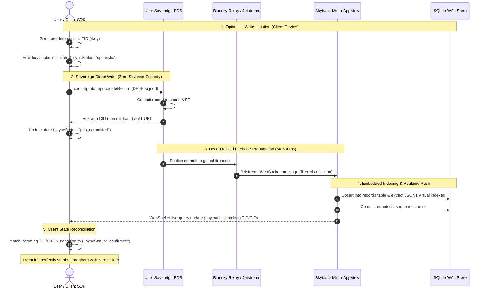

# 📄 Product Requirements Document (PRD)

# `skybase`
### The Turn-Key Micro-AppView Engine & Developer Platform for the AT Protocol ("Firebase-Like DX for ATProto")

---

## ⚡ Executive 1-Pager (The TL;DR)

| Dimension | Specification |
| :--- | :--- |
| **Product** | `skybase`: An open-source, single-binary Micro-AppView engine, local dev sandbox, and developer platform for the AT Protocol (ATProto). |
| **The Core Problem** | In ATProto, user data lives in sovereign Personal Data Servers (PDSs). While single-user authentication and writes are reasonably supported by official client libraries, **multi-user querying is completely unsolved**. An app cannot query 10,000 remote PDSs to render a feed, leaderboard, or search index. Developers are forced to hand-roll custom firehose consumers, backfill pipelines, and database schemas. |
| **The Strategic Wedge** | **The Single-Binary Micro-AppView**: Download one static binary (`./skybase`). Point it at your collection NSID (`com.myapp.review`). It continuously ingests Jetstream, stores records in an embedded SQLite WAL database with JSON1 virtual columns and FTS5 full-text search, and serves an instant REST & WebSocket live-query API. |
| **Three Operating Topologies** | **Topology A (Client-Sovereign / Zero Custody - Default)**: Browser/mobile app authenticates and writes directly to user PDS via `@atproto/oauth-client-browser`; Skybase runs as a zero-custody read indexer (holds 0 credentials).<br/>**Topology B (Daemon-Managed / Bots)**: Server-side daemons hold DPoP sessions via `skyauth` with AES-256-GCM token encryption at rest.<br/>**Topology C (Token-Mediated Session Proxy)**: Keeps sessions alive indefinitely (>2 weeks) for static frontends hosted on GitHub Pages, Wisp, or Tangled. |
| **Developer Experience** | Firestore-like developer ergonomics via `@skybase/client` TypeScript SDK:<br/>`skybase.collection('com.myapp.review').where('rating', '>=', 4).orderBy('date').onSnapshot(setReviews)`.<br/>No Rust toolchain required for frontend developers. |
| **Immediate Focus** | **Phase 1.5: The Thin Vertical Slice**: Prove the end-to-end loop (DPoP Login → PDS Write → Jetstream Ingest → SQLite Upsert → Live Query) on a single collection with Criterion benchmarks before broad expansion. |

---

## 1. Problem Statement & Ecosystem Context

### 1.1 The Decentralized Application Dilemma
In traditional Web2 architectures (Google Firebase, Supabase), backend development is straightforward: developers write to and read from a single centralized database.

In the **AT Protocol (ATProto)**, this mental model is completely inverted:
1. **User Data Sovereignty**: Every record (post, like, review, game move) resides in the user's personal repository (a signed Merkle Search Tree / MST) hosted on their sovereign **Personal Data Server (PDS)**. Applications do not own user data.
2. **The Micro-AppView Requirement**: Because user records are distributed across thousands of independent remote PDSs, an app cannot query them in real time. The application **must run an AppView** — an ingestion and indexing engine that consumes the network firehose, filters relevant records, and maintains a queryable aggregated database.
3. **The Undifferentiated Burden**: Hand-rolling an AppView requires managing WebSocket connections, CAR backfill pipelines, Jetstream sequence cursors, schema deserialization, database indexing, and WebSocket live-push diffs. This is where almost all ATProto app attempts die.

### 1.2 Ecosystem Voices: What Developers Actually Need
As highlighted in the Bluesky ecosystem discussion between developers:

> **garrison (`@garrison.corporate.fm`)**:
> *"the highest-leverage thing we can do to grow atproto right now is make it easier for devs to build apps on... 'firebase for atproto' is a good target... hosted components plus a friendlier database api, like firebase tried to be."*
>
> **Bailey Townsend (`@pds.dad`)**:
> *"Ah yes, an open source token mediated backend so oauth sessions can last longer than 2 weeks and devs can host their projects on wisp, tangled, or github pages."*

This feedback crystallizes the two unserved requirements:
1. **The "Friendlier Database API" + Ingestion Engine**: A query layer that abstracts away CAR sync, MST structures, and Jetstream byte streams into clean `.where().orderBy().limit()` and `.onSnapshot()` primitives.
2. **The Token-Mediated Backend for Static Sites**: A session proxy allowing developers hosting static apps on GitHub Pages, Wisp, or Tangled to maintain persistent OAuth sessions (>2 weeks) without browser storage eviction killing user logins.

### 1.3 Prior Art & Landscape Differentiation ("Why Not X?")

| Existing Tool | What It Does | Why It Is Insufficient / Where `skybase` Wins |
| :--- | :--- | :--- |
| **`@atproto/api`** | Official TypeScript XRPC client. | Only speaks to **one user's PDS at a time**. Has no database, cannot perform cross-user queries, and cannot build an aggregated feed or search index. |
| **`@atproto/oauth-client-*`**| Official TypeScript OAuth client. | Handles login flows, but provides zero data storage, firehose indexing, or query infrastructure. |
| **Bluesky's `Tap`** | Internal Go tool for filtering the raw firehose with backfill. | A low-level streaming pipe (event bus). It does **not** give you a queryable database, REST API, SQLite storage, or WebSocket push subscriptions. |
| **`skyware/jetstream`** | Node.js WebSocket client for Jetstream. | A raw WebSocket listener. You still have to hand-roll SQLite schemas, JSON parsing, cursor tracking, deduplication, and query endpoints. |
| **`HappyView`** | Lexicon-driven AppView server in Rust. | Focuses on runtime schema reflection and Lua scripting. Uses `atrium-oauth`. It is an AppView server, not an ergonomic BaaS/developer SDK. |
| **`skybase`** | **Complete Micro-AppView in one binary.** | Combines Jetstream ingestion + historical PDS backfill + SQLite WAL storage + JSON1 virtual indexes + FTS5 full-text search + REST/WebSocket live queries in a single prebuilt binary with zero configuration. |

### 1.4 Project Identity & Namespace Clarity
- **Disambiguation**: `skybase` is an independent open-source developer framework and Micro-AppView engine for the AT Protocol. It has no relationship or affiliation with `skybase.ai` (an enterprise Kubernetes/cloud security compliance product).
- **Public Namespaces**:
  - Rust Crate: `skybase` on crates.io
  - TypeScript SDK: `@skybase/client` and `@skybase/react` on npm
  - GitHub: `https://github.com/mike10010100/skybase`

---

## 2. Core Vision & Strategic Principles

### 2.1 The "Engine vs. Interface" Mandate (Avoiding the Language Trap)
- **The Market Reality**: 85–90% of ATProto application developers write TypeScript/JavaScript, Swift, Kotlin, or Dart. Only 10–15% write Rust or Go.
- **The PocketBase / Supabase / Meilisearch Playbook**:
  - **PocketBase** is written in Go, but 90% of its users write JavaScript and Dart.
  - **Supabase** is written in Elixir, Go, and C, but developers consume it via TypeScript.
  - **Meilisearch** is written in Rust, but developers interact via npm libraries.
- **Rust is an invisible superpower for the engine, not a barrier for the user**:
  - Sustains thousands of Jetstream events/sec with minimal memory (<100MB RAM design target) and zero garbage collection pauses.
  - Single zero-dependency static executable (`./skybase`). No Node.js runtime conflicts, no native node-gyp build failures, no mandatory Docker.
  - Pure Safe Rust (`#![forbid(unsafe_code)]`) with zero memory corruption, leveraging [`skyauth`]'s formally verified DPoP, PKCE, and SSRF filters.
- **The Golden Rule**: Frontend developers consume `skybase` via standard HTTP/WebSocket APIs and the `@skybase/client` TypeScript SDK. **Zero Rust toolchain required.**

### 2.2 The Deployment Spectrum: Answering "Hosted Components"
To accommodate everything from weekend hobbyists on GitHub Pages to production services:

```text
┌────────────────────────────────────────────────────────────────────────────────────────┐
│                               THE DEPLOYMENT SPECTRUM                                  │
├──────────────────────┬─────────────────────────┬───────────────────────────────────────┤
│ Tier                 │ Target Audience         │ What Runs Where                       │
├──────────────────────┼─────────────────────────┼───────────────────────────────────────┤
│ Level 0: Local Dev   │ Development / Offline   │ `npx skybase dev` runs on localhost;  │
│                      │                         │ embedded SQLite + mock Jetstream      │
├──────────────────────┼─────────────────────────┼───────────────────────────────────────┤
│ Level 1: 1-Click     │ Independent builders,   │ Single binary on Fly.io / Railway /   │
│ Self-Hosted          │ open-source projects    │ VPS (/mo); 1-click config templates │
├──────────────────────┼─────────────────────────┼───────────────────────────────────────┤
│ Level 2: Managed     │ Static frontend apps    │ Multi-tenant hosted Micro-AppView     │
│ "Skybase Cloud"      │ (GitHub Pages, Tangled, │ cloud; developers register NSIDs and  │
│ [Strategic Horizon]  │ Wisp, Vercel, Netlify)  │ get instant managed API endpoints     │
└──────────────────────┴─────────────────────────┴───────────────────────────────────────┘
```

### 2.3 Strict Engineering Blueprint
`skybase` adheres strictly to the **Production-Grade Rust Best Practices & Architecture Standards** defined in the user's reference repository ([`rust-best-practices`](/Users/mike10010100/git/rust-best-practices)):
- `#![forbid(unsafe_code)]` crate-wide.
- Strict crate-root lints (`missing_docs`, zero unwrap/expect/panic in production).
- Typed errors (`SkybaseError` via `thiserror`).
- Defensive concurrency: 64-shard `RwLock` partitioning, clock-warp safe math (`saturating_duration_since`), and cancellation token tracking.
- Detailed implementation rules are codified in [`AGENTS.md`](AGENTS.md).

---

## 3. The Three Operating Topologies (Solving Token Custody & Persistence)

To eliminate the conflict between "user data sovereignty" and practical backend operations, `skybase` explicitly supports three distinct operational topologies:

```text
┌─────────────────────────────────────────────────────────────────────────────────────────────────┐
│                                  THREE OPERATING TOPOLOGIES                                     │
├──────────────────────────┬──────────────────────────┬───────────────────────────────────────────┤
│ Topology                 │ Custodial Footprint      │ Primary Use Case                          │
├──────────────────────────┼──────────────────────────┼───────────────────────────────────────────┤
│ Topology A: Client-      │ ZERO Token Custody.      │ Default for Web (React/Next.js) & Mobile  │
│ Sovereign (Default)      │ Skybase holds 0 keys.    │ apps. Writes go direct from client to PDS.│
├──────────────────────────┼──────────────────────────┼───────────────────────────────────────────┤
│ Topology B: Daemon-      │ Managed Custody. Tokens  │ Background daemons, automated bots, and   │
│ Managed (Bots/Daemons)   │ encrypted with AES-256.  │ feed generators requiring offline writes. │
├──────────────────────────┼──────────────────────────┼───────────────────────────────────────────┤
│ Topology C: Token-       │ Session Proxy. Confidential│ Static SPAs on GitHub Pages, Wisp, and  │
│ Mediated Session Broker  │ refresh token rotation.  │ Tangled. Eliminates 2-week session drop.  │
└──────────────────────────┴──────────────────────────┴───────────────────────────────────────────┘
```

### 3.1 Topology A: Client-Sovereign (Zero Skybase Custody — Default)
- **How it works**: The user logs in on the client using `@atproto/oauth-client-browser`. DPoP private keys remain in browser IndexedDB or platform keystores. Writes are submitted directly from the client to the user's personal PDS via XRPC.
- **Role of Skybase**: Operates purely as a read/indexing Micro-AppView, consuming public commits from Jetstream.
- **Sovereignty**: **100% absolute.** `skybase` never sees, stores, or proxies user refresh tokens.

### 3.2 Topology B: Daemon-Managed (Backend Automation & Bots)
- **How it works**: Used when a backend bot or feed generator must sign records autonomously without a user in the browser. Powered by [`skyauth`].
- **Honest Security Boundary**: In this mode, the server **is** an OAuth credential custodian.
- **Storage at Rest**: All refresh tokens and private keys stored at rest are encrypted with **AES-256-GCM** under an application master key (`SKYBASE_MASTER_KEY`). In-memory keys implement `zeroize::Zeroize` on drop.

### 3.3 Topology C: Token-Mediated Session Proxy (Static Hosting / GitHub Pages)
- **How it works (Solving Bailey Townsend's Challenge)**: Static single-page applications hosted on GitHub Pages, Wisp, or Tangled rely on public-client OAuth, where browser storage evictions and token rotation kill sessions after ~2 weeks of inactivity.
- **The Solution**: A lightweight deployed Skybase instance acts as a **Confidential OAuth Session Proxy**. Skybase maintains the long-lived DPoP session and rotates refresh tokens continuously in the background, issuing a persistent session token to the static frontend. Users stay logged in indefinitely.

---

## 4. Architectural Blueprint & Data Flow

### 4.1 System Architecture Diagram

```mermaid
flowchart TD
    subgraph ClientLayer ["Client Applications"]
        BrowserApp["Web / Mobile App (Topology A: Zero Custody)"]
        StaticApp["Static Site on GitHub Pages / Wisp (Topology C: Mediated)"]
        BrowserAuth["@atproto/oauth-client-browser<br/>(Ephemeral Keys in IndexedDB)"]
        BrowserApp -.-> BrowserAuth
    end

    subgraph DaemonLayer ["Server Backend (Topology B: Managed Custody)"]
        RustDaemon["Automated Bot / Feed Generator"]
        SkyauthVault["skyauth Token Vault<br/>(AES-256-GCM Encrypted at Rest)"]
        RustDaemon -.-> SkyauthVault
    end

    subgraph SkybaseEngine ["Skybase Micro-AppView Engine (Single Binary or Hosted)"]
        Gateway["REST & WebSocket API Gateway (/api/v1)"]
        SessionMediator["OAuth Session Mediator (Topology C)<br/>(Persistent >2-Week Sessions)"]
        
        subgraph IngestionPillar ["skybase-index (Micro-AppView Core)"]
            JetstreamSub["Jetstream Firehose Consumer (Filtered NSIDs)"]
            BackfillCrawler["PDS Backfill Crawler (com.atproto.sync.getRepo)"]
            CursorTracker["Monotonic Sequence Cursor (Disk WAL)"]
            SqliteStore[("Embedded SQLite WAL<br/>(Canonical records + JSON1 + FTS5)")]
            QueryEngine["High-Speed Query Builder & Indexer"]
        end
        
        subgraph RealtimePillar ["skybase-events"]
            LiveQueryBroker["WebSocket Live-Query Push Broker"]
            ReconciliationEngine["Optimistic State Reconciliation Tracker"]
        end
        
        subgraph ServerWritePillar ["skybase-repo (Optional Daemon Writes)"]
            XrpcClient["XRPC Client (DPoP Signed)"]
        end
    end

    subgraph AtprotoNetwork ["Decentralized ATProto Ecosystem"]
        UserPds["User PDS (Authoritative MST Repository)"]
        JetstreamRelay["Bluesky Jetstream Relay (Global Firehose)"]
        PlcDir["PLC Directory (did:plc & did:web)"]
    end

    %% Topology A (Zero Custody) Flow: Writes go direct to PDS!
    BrowserApp -->|1. Direct Sovereign Write (DPoP)| UserPds
    UserPds -->|2. Broadcast Commit| JetstreamRelay
    JetstreamRelay -->|3. Stream Filtered NSID Commits| JetstreamSub
    JetstreamSub --> SqliteStore
    JetstreamSub --> LiveQueryBroker
    LiveQueryBroker -->|4. Push Realtime Diffs (WebSocket)| BrowserApp
    BrowserApp -->|5. High-Speed Reads & FTS| Gateway
    Gateway --> QueryEngine
    QueryEngine --> SqliteStore

    %% Topology C (Static Mediated Flow): Session kept alive by Skybase
    StaticApp -->|OAuth & Session Delegation| SessionMediator
    SessionMediator -->|PAR & Token Refresh| UserPds
    StaticApp -->|Live Query & Reads| Gateway

    %% Topology B (Server Custodial) Flow: Daemon writes
    RustDaemon --> XrpcClient
    XrpcClient -->|Server-Signed Write| UserPds

    %% Cold Start Backfill
    BackfillCrawler -->|Historical Sync (CAR export)| UserPds
    BackfillCrawler --> SqliteStore
```

### 4.2 The Sovereign Write & Optimistic Reconciliation Flow
ATProto commits take 50ms–500ms to propagate from PDS → Relay → Jetstream → Micro-AppView → Client. Skybase resolves this eventual consistency gap with the **Optimistic State Reconciliation Protocol**:



---

## 5. Technical Specifications: The Core Engine

### 5.1 Embedded Micro-AppView (`skybase-index`)
- **Filtered Jetstream Ingestion**: Subscribes to Bluesky Jetstream (`wss://jetstream1.us-east.bsky.network/subscribe`) filtering exclusively for target collection NSIDs (e.g. `wantedCollections=com.myapp.review`), drastically minimizing bandwidth and CPU overhead.
- **Dual-Stage Sync (Catch-up & Real-Time)**:
  1. *Catch-up Phase*: On cold start or extended downtime, Jetstream's short replay window (~days) cannot backfill historical data. Skybase crawls PDS repositories via `com.atproto.sync.getRepo` (CAR export) to backfill records.
  2. *Real-Time Phase*: Hands off seamlessly to the live Jetstream WebSocket stream once synchronized.
- **Lexicon-to-SQLite Schema Mapping**:
  - Rather than fragile dynamic DDL (`ALTER TABLE`), Skybase uses a canonical envelope table with SQLite JSON1 virtual columns and full-text search:
  ```sql
  CREATE TABLE records (
      did TEXT NOT NULL,
      collection TEXT NOT NULL,
      rkey TEXT NOT NULL,
      cid TEXT NOT NULL,
      rev TEXT,
      payload TEXT NOT NULL, -- Exact JSON representation of the Lexicon record
      created_at INTEGER NOT NULL,
      indexed_at INTEGER NOT NULL,
      PRIMARY KEY (did, collection, rkey)
  );

  -- Deterministic secondary indexes on extracted JSON fields:
  CREATE INDEX idx_records_rating ON records(collection, json_extract(payload, '$.rating'));

  -- SQLite FTS5 contentless/external-content table for BM25 text ranking:
  CREATE VIRTUAL TABLE records_fts USING fts5(payload, content='records', content_rowid='rowid');
  ```
- **SQLite WAL Optimization**: Write-Ahead Logging (`PRAGMA journal_mode=WAL`), memory-mapped I/O (`PRAGMA mmap_size`), and synchronous normal mode for concurrent multi-reader throughput and sub-millisecond writes.

### 5.2 Realtime Live Queries (`skybase-events`)
- **WebSocket Gateway (`/api/v1/realtime`)**: Clients subscribe to collection streams with filter expressions:
  ```json
  { "action": "subscribe", "collection": "com.myapp.review", "filter": { "rating": { "": 4 } } }
  ```
- **Broadcast Events**: Commits, updates, and deletes are broadcast to connected clients in real time with sequence numbers, rkeys, and CIDs for optimistic reconciliation.
- **Durable Sequence Cursor**: Monotonic Jetstream sequence timestamps are committed to disk WAL, ensuring zero dropped events across daemon restarts.

### 5.3 Local Dev Sandbox & 1-Click Cloud Daemon (`skybase-server`)
- **Local Sandbox (`./skybase dev --mock`)**: Starts a complete self-contained dev environment with a built-in mock Jetstream event generator/replayer and mock PDS receiver, allowing developers to build and test completely offline.
- **Embedded Web Admin Dashboard**: Bundled SPA (`rust-embed`) at `http://localhost:8080/_/admin` for live collection inspection, query benchmarking, and stream health.
- **1-Click Cloud Deployment**: Pre-configured `fly.toml` and `railway.json` templates to deploy Skybase with persistent SQLite storage in 60 seconds (/mo).

### 5.4 Backend Automation & Storage (`skybase-repo`, `skybase-auth`, `skybase-storage`)
- **`skybase-auth`**: Managed session coordinator for background daemons; AES-256-GCM encryption at rest; token-mediated session broker for static frontends.
- **`skybase-repo`**: Server-side XRPC record creation, updates, and atomic batch mutations (`applyWrites`) with DPoP credentials.
- **`skybase-storage`**: PDS blob upload (`uploadBlob`) with SHA-256 CID calculation and MIME magic-byte verification.

---

## 6. Scope Discipline & Tiered Feature Matrix

To eliminate "schedule fantasy" while maintaining uncompromising Rust safety invariants (`#![forbid(unsafe_code)]`, zero panics, typed errors), `skybase` strictly phases its feature surface into three concrete tiers:

### 6.1 Tier 1: The Core Wedge (v0.1 MVP — Immediate Implementation Focus)
*The minimal complete product that solves the genuine, unserved ATProto bottleneck.*

| Component | Target Pillar | Scope & Capabilities in v0.1 |
| :--- | :--- | :--- |
| **Embedded Micro-AppView** | `skybase-index` | Targeted Jetstream ingestion for configured NSIDs; embedded SQLite WAL with canonical `records` table; JSON1 virtual indexes; FTS5 full-text search; sub-millisecond multi-user queries. |
| **Historical PDS Backfill** | `skybase-index` | Cold-start & downtime recovery via `com.atproto.sync.getRepo` CAR sync before seamless handoff to live Jetstream stream. |
| **Live Real-Time Queries** | `skybase-events` | WebSocket live-query streaming (`/api/v1/realtime`) with push updates on record commits, updates, and deletes. |
| **Local Dev Sandbox & 1-Click Deploy** | `skybase-server` | Single static binary (`./skybase dev`) with embedded SQLite; `--mock` mode providing offline synthetic Jetstream event replay; pre-configured `fly.toml` & `railway.json` templates for 60-second cloud deployment. |
| **Web Admin Console** | `skybase-server` | Embedded SPA (`rust-embed`) at `/_/admin` for live collection inspection, query benchmarking, and stream health. |
| **Zero-Custody Client SDK** | `@skybase/client` | TypeScript SDK linking browser-side `@atproto/oauth-client-browser` writes directly to PDS with `skybase` live query subscriptions and optimistic state reconciliation. |

### 6.2 Tier 2: Backend Automation & Custodial Operations (v0.2)
*For backend daemons, automated bots, and static frontends (GitHub Pages/Wisp/Tangled) requiring persistent session mediation.*

| Component | Target Pillar | Scope & Capabilities in v0.2 |
| :--- | :--- | :--- |
| **Token-Mediated Session Proxy** | `skybase-auth` | Confidential OAuth session broker for static SPAs (GitHub Pages, Tangled, Wisp) preventing the 2-week session drop caused by browser storage clearing. |
| **Server-Side Repo CRUD** | `skybase-repo` | DPoP-signed XRPC calls (`createRecord`, `putRecord`, `deleteRecord`, `applyWrites`) from daemon to PDS. |
| **Daemon Credential Custody** | `skybase-auth` | Managed OAuth 2.1 lifecycle via `skyauth`; **AES-256-GCM encryption at rest** for refresh tokens; in-memory key zeroization. |
| **Sovereign Blob Management** | `skybase-storage` | PDS `uploadBlob` client, SHA-256 CID computation, and MIME magic-byte validation. |
| **Declarative Event Hooks** | `skybase-events` | In-process asynchronous Rust hooks (`skybase.events().on_create(...)`) with durable sequence cursor persistence. |

### 6.3 Tier 3: Post-v1 & Enterprise Extensions (Strategic Horizon)
*Architected for, but explicitly out of scope for initial release.*

| Extension | Target Capability | Rationale for Deferral |
| :--- | :--- | :--- |
| **Managed "Skybase Cloud"** | Multi-tenant hosted Micro-AppView platform | Hosted multi-tenant service for developers who want zero server management (Supabase Cloud style). |
| **Enterprise Database** | PostgreSQL backend adapter | SQLite WAL easily scales to millions of records on a single node; premature distributed DB complexity. |
| **Embedded Scripting Engine** | QuickJS / Boa JS runtime | HTTP webhooks solve external extensibility cleanly without embedding a JS VM inside the Rust daemon. |
| **Edge CDN Blob Proxy** | Cloudflare R2 / AWS S3 edge cache | Direct PDS blob URLs are sufficient for early stage apps; CDN caching is an optimization, not a blocker. |
| **Multi-Node Clustering** | Raft consensus / distributed indexers | Single-binary simplicity is the primary differentiator against complex enterprise infrastructure. |

---

## 7. Developer Experience: Code Examples

### 7.1 Frontend Developer Experience (TypeScript SDK)

```typescript
import { SkybaseClient } from '@skybase/client';

const skybase = new SkybaseClient({
  endpoint: 'http://localhost:8080', // or https://api.myapp.com
});

// 1. Direct Multi-User Collection Query
const topReviews = await skybase.collection('com.example.book.review')
  .where('rating', '>=', 4)
  .where('genre', '==', 'cyberpunk')
  .orderBy('createdAt', 'desc')
  .limit(20)
  .get();

// 2. Instant Full-Text Search
const searchResults = await skybase.collection('com.example.book.review')
  .search('Hiro Protagonist Snow Crash')
  .limit(10)
  .get();

// 3. Real-Time Live Query Subscription (with Optimistic Reconciliation)
const unsubscribe = skybase.collection('com.example.book.review')
  .where('itemId', '==', 'book:snow-crash')
  .onSnapshot((reviews) => {
    console.log('Live reviews updated:', reviews);
  });

// 4. Sovereign Write directly to User PDS (Zero Skybase Custody)
const newReview = await skybase.collection('com.example.book.review').create({
  title: 'Snow Crash',
  rating: 5,
  reviewText: 'Essential cyberpunk reading.',
  createdAt: new Date().toISOString(),
});
```

### 7.2 Backend & Systems Developer Experience (Rust Crate)

```rust
use skybase::{Skybase, SkybaseConfig};

#[tokio::main]
async fn main() -> Result<(), Box<dyn std::error::Error>> {
    let config = SkybaseConfig::new(
        "https://myapp.com/oauth/client-metadata.json",
        "https://myapp.com/oauth/callback",
        "My ATProto Application",
    )
    .with_jetstream_endpoint("wss://jetstream1.us-east.bsky.network/subscribe");

    let skybase = Skybase::new(config)?;

    // Register declarative trigger on indexed collection
    skybase.events().on_create("com.example.book.review", |event| async move {
        println!("Indexed new review from {}: {}", event.did, event.record.title);
        Ok(())
    });

    Ok(())
}
```

---

## 8. Implementation Roadmap & Milestones

### Phase 1: Foundation & Core Configuration (Completed)
- [x] Standalone repository initialization (`#![forbid(unsafe_code)]`, strict lints, typed errors).
- [x] Integrate `skyauth` dependency and implement `SkybaseConfig` with validation.
- [x] Establish architectural blueprint (`PRD.md`), developer quickstart (`README.md`), and formal `AGENTS.md` guidelines.
- [x] Create public GitHub repository (`https://github.com/mike10010100/skybase`).

### Phase 1.5: The Thin Vertical Slice (De-Risking the Core Thesis — In Progress)
> *Priority Objective: Rather than attempting to build 8 pillars wide, cut a complete end-to-end vertical slice across one single collection (`app.bsky.feed.post` or custom test NSID). Prove the dual-path thesis with running code and hermetic integration tests before expanding.*
- [ ] Implement canonical SQLite `records` table with JSON1 extraction and FTS5 search.
- [ ] Build minimal Jetstream WebSocket consumer filtering for the single target collection.
- [ ] Build minimal `createRecord` client using `skyauth` DPoP signing.
- [ ] Execute hermetic integration test:
  $$\text{DPoP Login} \longrightarrow \text{createRecord (PDS)} \longrightarrow \text{Jetstream Ingest} \longrightarrow \text{SQLite Upsert} \longrightarrow \text{.where().limit() Query} \longrightarrow \text{WebSocket Event}$$
- [ ] Measure and record empirical baseline benchmarks (ingest throughput, memory usage, query latency) with Criterion.

### Phase 2: Production Micro-AppView & Local Dev Sandbox (Tier 1 Core Wedge)
- [ ] Implement dual-stage ingestion: historical backfill crawler (`com.atproto.sync.getRepo` / CAR sync) with seamless handoff to live Jetstream stream.
- [ ] Monotonic cursor tracking with durable disk WAL persistence.
- [ ] Hermetic local dev sandbox (`./skybase dev --mock`) with synthetic Jetstream event replay.
- [ ] Axum 0.7 REST and WebSocket live-query gateway (`/api/v1/collections/*`, `/api/v1/realtime`).
- [ ] Embedded single-binary Web Admin console (`rust-embed`) at `http://localhost:8080/_/admin`.
- [ ] 1-Click cloud deployment templates (`fly.toml`, `railway.json`, `Dockerfile`) with persistent SQLite WAL volume storage.

### Phase 3: Zero-Custody Client SDK & Community Feedback Loop
- [ ] Implement `@skybase/client` TypeScript SDK linking browser-side `@atproto/oauth-client-browser` writes to Skybase live queries.
- [ ] Implement Optimistic State Reconciliation Protocol (`isPending`, `isOptimistic`, `isLagging`) in TypeScript client and React hooks (`@skybase/react`).
- [ ] Record a 5-minute video demo: "Login → Write sovereign record to PDS → Instant local AppView live query".
- [ ] Targeted community review: Bluesky/ATProto developer Discord, atproto Discourse, and Bluesky network thread with targeted questions.

### Phase 4: Backend Automation & Custodial Operations (Tier 2 Expansion)
- [ ] Implement `skybase-auth` managed session coordinator for autonomous daemons and bots.
- [ ] Implement **Token-Mediated Session Proxy** for static frontends (GitHub Pages, Tangled, Wisp) to maintain persistent sessions (>2 weeks).
- [ ] Implement **AES-256-GCM encryption at rest** for daemon-held DPoP refresh tokens (`SKYBASE_MASTER_KEY`).
- [ ] Implement `skybase-repo` server-side XRPC writes (`createRecord`, `putRecord`, `deleteRecord`, `applyWrites`).
- [ ] Implement `skybase-storage` PDS blob upload (`uploadBlob`), SHA-256 CID computation, and MIME header validation.
- [ ] Implement declarative in-process Rust event hooks (`skybase.events().on_create(...)`).

### Phase 5: Production Hardening, Compliance & Reference Apps
- [ ] Security audit, mutation testing sweep, and `cargo deny check` policy enforcement.
- [ ] Reference application templates:
  - Decentralized Book Reviews (`com.example.book.review`)
  - Real-time Micro-Chat (`com.example.chat.message`)
  - Public Polling & Leaderboards (`com.example.poll`)
- [ ] Documentation site and npm release of `@skybase/client`.

### Post-v1 Horizon (Tier 3 Extensions)
- [ ] Multi-tenant managed **"Skybase Cloud"** platform for instant hosted components.
- [ ] Pluggable PostgreSQL backend adapter for multi-node deployments.
- [ ] Edge media CDN proxy with Cloudflare R2 / AWS S3 caching.
- [ ] Embedded lightweight JS/WASM scripting runtime for custom triggers.
