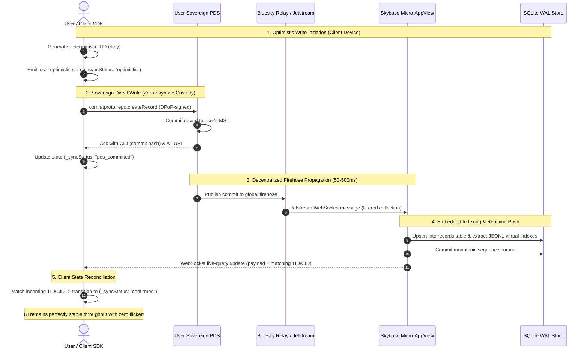

# 📄 Product Requirements Document (PRD)

# `skybase`
### The Turn-Key Micro-AppView Engine & Backend Platform for the AT Protocol ("Firebase-Like DX for ATProto")

---

## 1. Executive Summary & Problem Statement

### 1.1 Context: The Decentralized Application Dilemma
In traditional Web2 architectures (Google Firebase, Supabase, AWS Amplify), developing an application backend is streamlined:
1. **Centralized Database**: Developers write to and read from a single database (Firestore, PostgreSQL) hosted by the application.
2. **Custodial Authentication**: Authentication is simple (OAuth, passwords) and grants permissions directly to the central database.
3. **Synchronous Writes & Reads**: When a user creates a record, it is written directly to the database and is immediately queryable across all users.
4. **Centralized Storage & Cloud Functions**: Blobs are uploaded to an S3/GCS bucket; event hooks trigger functions directly off database write streams.

In the **AT Protocol (ATProto)**, this mental model is inverted:
- **Sovereign User Repositories (MSTs)**: Users own their data. Every post, like, comment, game move, or custom record resides in the user's personal repository (a signed Merkle Search Tree) hosted on their sovereign **Personal Data Server (PDS)**. Applications *do not and cannot* own user data.
- **The Micro-AppView Requirement**: Because user data is distributed across thousands of independent PDS instances, an application cannot query individual PDSs in real-time to render an aggregated feed, comments list, or search index. The application **must run an AppView** — an ingestion and indexing engine that consumes the global firehose, filters relevant collection records, and maintains an aggregated queryable index.
- **Authentication Complexity**: App passwords are deprecated for public apps. ATProto mandates **OAuth 2.1 with RFC 9449 DPoP (Demonstrating Proof-of-Possession)**, **RFC 9126 PAR (Pushed Authorization Requests)**, **RFC 7636 PKCE**, decentralized identity discovery (`did:plc`, `did:web`, DNS TXT, `.well-known`), and strict SSRF defenses.
- **Firehose Ingestion Scalability**: Consuming the ATProto firehose or Jetstream requires managing WebSocket connections, backpressure, cursor persistence, sequence reordering, and schema deserialization.

### 1.2 The Ecosystem Problem & The Real Bottleneck
Currently, developers wanting to build an application on ATProto face a massive barrier to entry. But where is the actual bottleneck?

* **Frontend Auth & Single-User Writes Are Already Solved**: Official client-side TypeScript libraries (`@atproto/api`, `@atproto/oauth-client-browser`) already allow a frontend web app or mobile client to authenticate users and write records directly to their PDS from the browser.
* **The Actual Unsolved Friction Is Multi-User Querying**: The moment a developer wants to show:
  - *"All reviews for this book"*
  - *"All comments on this article"*
  - *"A leaderboard of players in this game"*
  - *"A full-text search across all user-generated records"*
  ...they hit a brick wall. A client cannot query 10,000 independent remote PDSs in real time. **Every developer is forced to build their own firehose consumer, backfill pipeline, database schema, and query API.** This undifferentiated heavy lifting is where almost all ATProto app attempts die.

As highlighted in the Bluesky ecosystem discussion between developers:
> *"the highest-leverage thing we can do to grow atproto right now is make it easier for devs to build apps on... 'firebase for atproto' is a good target."*

### 1.3 The Strategic Wedge: The Turn-Key Micro-AppView Engine
Rather than attempting to boil the ocean by shipping 8 disparate pillars at once, `skybase` enters the market with a **razor-sharp wedge**:

> **The Turn-Key, Single-Binary Micro-AppView**:
> Download one binary (`./skybase`). Point it at your application's collection NSID (`com.myapp.review`). It continuously ingests the Jetstream firehose, stores records in an embedded SQLite WAL database with full-text search (FTS5), and exposes an instant REST & WebSocket query API.

This wedge unlocks an immediate architectural breakthrough: **Zero Token Custody**.
- In standard web and mobile apps, the user authenticates in the browser via `@atproto/oauth-client-browser` and writes directly to their personal PDS.
- `skybase` runs as a zero-custody Micro-AppView, indexing public commits from Jetstream.
- **Skybase never holds, stores, or touches user private OAuth refresh tokens.** The "sovereignty" promise is 100% literal.
- *(For backend bots and feed generators requiring server-side writes, `skybase` integrates `skyauth` with AES-256-GCM encrypted tokens at rest).*

### 1.4 Prior Art & Landscape Differentiation ("Why Not X?")

Knowledgeable ATProto developers will immediately ask: *"How does this compare to existing tools?"*

| Existing Tool | What It Does | Why It Is Insufficient / Where `skybase` Wins |
| :--- | :--- | :--- |
| **`@atproto/api`** | Official TypeScript XRPC client. | Only speaks to **one user's PDS at a time**. Has no database, cannot perform cross-user queries, and cannot build an aggregated feed or search index. |
| **`@atproto/oauth-client-*`**| Official TypeScript OAuth client. | Handles login flows, but provides zero data storage, firehose indexing, or query infrastructure. |
| **Bluesky's `Tap`** | Internal Go tool for filtering the raw firehose with backfill. | A low-level streaming pipe (event bus). It does **not** give you a queryable database, REST API, SQLite storage, or WebSocket push subscriptions. |
| **`skyware/jetstream`** | Node.js WebSocket client for Jetstream. | A raw WebSocket listener. You still have to hand-roll SQLite schemas, JSON parsing, cursor tracking, deduplication, and query endpoints. |
| **`HappyView`** | Lexicon-driven AppView server in Rust. | Focuses on runtime schema reflection and Lua scripting. Uses `atrium-oauth`. It is an AppView server, not an ergonomic BaaS/developer SDK. |
| **`skybase`** | **Complete Micro-AppView in one binary.** | Combines Jetstream ingestion + historical PDS backfill + SQLite WAL storage + JSON1 virtual indexes + FTS5 full-text search + REST/WebSocket live queries in a single prebuilt binary with zero configuration. |

### 1.5 Project Identity & Namespace Clarity
- **Disambiguation**: `skybase` is an independent open-source developer framework and Micro-AppView engine for the AT Protocol. It has no relationship, affiliation, or association with `skybase.ai` (an enterprise Kubernetes/cloud security compliance product).
- **Public Namespaces**:
  - Rust Crate: `skybase` on crates.io
  - TypeScript SDK: `@skybase/client` and `@skybase/react` on npm
  - GitHub: `https://github.com/mike10010100/skybase`
  - Bluesky/ATProto: `#skybase` / `@skybase.dev`

---

## 2. Core Vision & Design Principles

### 2.1 Reference Blueprint & Standards
`skybase` is designed and implemented following the **Production-Grade Rust Best Practices & Architecture Standards** defined in the reference repository:
- **Reference Repo**: [`rust-best-practices`](/Users/mike10010100/git/rust-best-practices)
- **Architecture Guide**: [`BEST_PRACTICES.md`](/Users/mike10010100/git/rust-best-practices/BEST_PRACTICES.md)
- **Tooling Blueprint**: [`TOOLING.md`](/Users/mike10010100/git/rust-best-practices/TOOLING.md)
- **Agent Blueprint**: [`agents.md`](/Users/mike10010100/git/rust-best-practices/agents.md)
- **Sibling Ecosystem**: [`skyauth`](../skyauth) and [`for-your-consideration`](../for-your-consideration)

### 2.2 Core Non-Negotiable Invariants
1. **100% Pure Safe Rust (`#![forbid(unsafe_code)]`)**:
   - Zero `unsafe` blocks in crate roots ([`src/lib.rs`](src/lib.rs)) or sub-modules. No dependencies that circumvent compiler safety guarantees.
2. **Strict Crate-Root Safety Guard**:
   - Enforced compiler lints:
     ```rust
     #![deny(
         clippy::all,
         clippy::unwrap_used,     // Deny unwrap(), force explicit error handling
         clippy::expect_used,     // Deny expect(), force structured errors
         clippy::panic,           // Deny panic!, force error bubbling
         clippy::todo,            // Deny todo! placeholders in production
         clippy::unimplemented,   // Deny unimplemented! macros
         missing_docs,            // Enforce public API documentation
         rust_2018_idioms         // Use modern Rust idioms
     )]
     ```
3. **Zero Production Panics & Typed Errors**:
   - Deny `.unwrap()`, `.expect()`, `panic!`, `todo!`, and `unimplemented!` in production paths. All fallible operations return strongly typed `Result<T, SkybaseError>` using variants in [`src/error.rs`](src/error.rs).
4. **User Sovereignty by Default**:
   - `skybase` never takes custodial ownership of user data. All records are written directly to the user's sovereign PDS repository. The local `skybase-index` is an ephemeral, rebuildable read projection (AppView), never a custodial walled garden.
5. **Defensive Concurrency & 64-Shard Partitioning**:
   - High-concurrency state structures (session caches, subscription tables, memory indexes) use **64 independent `RwLock` shards** to eliminate lock contention under multi-threaded load.
   - **Never Hold Locks Across `.await` Points**: Synchronous mutex or `RwLock` guards must always be dropped before executing any `.await`, `sleep()`, or network I/O.
6. **Clock-Warp Safety & Drift-Free Scheduling**:
   - Elapsed time is always computed using `now.saturating_duration_since(earlier)` or `.map_or(0, ...)` to guarantee resilience against backwards monotonic clock jumps during VM migrations or NTP syncs.
   - Recurring tasks (Jetstream cursor commits, cache evictions, token renewals) must calculate next runs relative to the previous anchor timestamp or use `tokio::time::interval`, not relative `Instant::now() + delay`.
7. **Task Leak Prevention & Managed Cancellation**:
   - All background tasks (firehose ingestion, event dispatching, health checkers) are tracked in a managed `tokio::task::JoinSet` tied to a `tokio_util::sync::CancellationToken`. On shutdown or timeout, tasks are cleanly aborted and joined.
8. **100% Documentation Coverage**:
   - All public structs, fields, constants, enums, modules, and functions must have descriptive documentation comments (`missing_docs` is denied). Bare URLs in documentation must be enclosed in angle brackets (e.g. `<https://bsky.social>`).
### 2.3 Strategic Architecture: The "Engine vs. Interface" Mandate (Avoiding the Language Trap)
A critical strategic question for `skybase` is: *Are we pigeonholing ourselves by building in Rust?*

The answer is: **Only if we force developers to write Rust to use it.**

#### The Market Reality
- In the AT Protocol ecosystem, **85–90%** of application developers write **TypeScript / JavaScript (React, React Native, Next.js), Swift (iOS), Kotlin (Android), or Flutter**.
- Only **10–15%** are systems/backend engineers writing Rust or Go.
- If `skybase` were *only* an embeddable Rust crate requiring developers to install `cargo` and write Rust code to build their app, the project would artificially restrict its addressable market to a tiny fraction of builders.

#### The "PocketBase / Supabase / Meilisearch" Playbook
The most successful modern developer platforms solve this by separating the **Engine** from the **Interface**:
- **PocketBase** is written 100% in Go, but 90% of its users write JavaScript and Dart.
- **Supabase** is written in Elixir, Go, and C (Postgres), but its developers write TypeScript and Python.
- **Meilisearch** is written 100% in Rust, but frontend developers consume it via simple npm packages.
- **Firebase** is written in C++, Java, and Go, but developers interact exclusively through JavaScript, Swift, and Kotlin SDKs.

**Rust is an invisible superpower for the engine, not a barrier for the developer.**
- **Firehose Ingestion Scale**: Processing the global Jetstream firehose requires sustaining thousands of events per second without garbage collection pauses or thread starvation. Rust enables `skybase` to achieve this with minimal CPU overhead and compact memory usage on modest cloud instances. (*Design targets: >5,000 events/sec sustained throughput, <100MB idle RAM, sub-50ms daemon boot time; to be formally benchmarked via automated Criterion suites in Phase 1.5*).
- **Single Zero-Dependency Binary**: Developers download one static executable (`./skybase`, target size ~15–20MB). No Node.js runtime conflicts, no native C++ node-gyp compilation failures, and no mandatory Docker setup.
- **Formally Verified Cryptographic Kernel**: Pure Safe Rust (`#![forbid(unsafe_code)]`) with zero memory corruption, leveraging [`skyauth`]'s formally proven DPoP, PKCE, and SSRF filters.

#### The Three Golden Rules to Avoid Pigeonholing
To ensure `skybase` captures the entire developer ecosystem, the project strictly enforces three architectural rules:

1. **Rule 1: The Primary Interface is HTTP / WebSocket + First-Class TypeScript SDK (`@skybase/client`)**
   - 90% of developers will interact with `skybase` via TypeScript/JavaScript:
     ```typescript
     import { Skybase } from '@skybase/client';
     const sb = new Skybase('http://localhost:8080');
     await sb.auth.signInWithHandle('alice.bsky.social');
     const post = await sb.collection('app.bsky.feed.post').create({ text: 'Hello!' });
     sb.collection('app.bsky.feed.post').where('author', '==', 'alice.bsky.social').onSnapshot(setPosts);
     ```
   - The developer experience feels identical to Firebase; the developer never knows or cares that Rust powers the engine.

2. **Rule 2: Zero-Install Local Developer Experience (No Rust Toolchain Required)**
   - Frontend developers can launch a local backend without installing Rust or Cargo:
     ```bash
     npx skybase dev    # Target distribution via npm binary wrapper (Phase 5)
     # or
     brew install skybase && skybase
     # or
     docker run -p 8080:8080 skybase/skybase
     ```
   - The single binary boots in milliseconds, initializes SQLite, starts the API gateway, and serves the embedded Web Admin dashboard.

3. **Rule 3: Extensibility Without Recompilation (Webhooks & Scripting)**
   - In Firebase, developers write Cloud Functions in TypeScript. If `skybase` required recompiling Rust to add an event trigger, it would alienate non-Rust developers.
   - `skybase` resolves this via:
     - **HTTP Webhooks**: Dispatches HTTP POST notifications to any external server (e.g. Next.js `/api/webhooks/*` or AWS Lambda) when record mutations occur.
     - **Embedded Scripting [Post-v1 Extension]**: Lightweight embedded JavaScript (via QuickJS / Boa) or WASM plugins for running server-side triggers directly inside the daemon.
     - **Native Rust Crate**: Remains available as a direct compile-time dependency for high-performance systems developers (feed generators, custom relays, and firehose indexers).

---

## 3. Deep Architectural Review: What Firebase Actually Does vs. The ATProto Reality

> **Positioning Note: "Micro-AppView Backend", Not a Literal Firestore Clone**
> While `skybase` adopts Firebase's beloved developer experience (one-liner auth, collection/document queries, `.onSnapshot()`), ATProto is fundamentally an **eventually-consistent, decentralized protocol**. In Firestore, writes are immediately globally consistent in Google's cloud. In ATProto, writes are sovereign to the user's PDS, then asynchronously broadcast over the network firehose to the AppView. We position `skybase` honestly: an **AppView Backend with Firebase-like developer ergonomics**, not a false promise of immediate multi-user ACID consistency.

To build an authentic "Firebase for the AT Protocol", we must rigorously deconstruct what Firebase does, why developers rely on it, the fundamental architectural conflict posed by decentralized ATProto, and how `skybase` resolves each challenge in pure Safe Rust.

```text
┌────────────────────────────────────────────────────────────────────────────────────────┐
│                              WHAT FIREBASE ACTUALLY DOES                              │
├────────────────────┬───────────────────────────────────────────────────────────────────┤
│ 1. Identity & Auth │ Firebase Auth: User directory, social OAuth, JWT sessions         │
│ 2. Data Storage    │ Firestore: NoSQL document store, compound queries, collections    │
│ 3. Realtime Sync   │ onSnapshot(): Persistent WebSocket push updates down to clients   │
│ 4. Offline First   │ Optimistic UI updates, local cache, background sync on reconnect  │
│ 5. Blob / Media    │ Cloud Storage: Direct client upload to GCS, signed URLs, CDN      │
│ 6. Logic / Triggers│ Cloud Functions: Serverless handlers on DB writes, Auth, Crons   │
│ 7. Access Rules    │ Security Rules: Declarative authorization (request.auth.uid)      │
│ 8. Local Emulator  │ Emulator Suite & Console: Local offline testing + Web Dashboard   │
└────────────────────┴───────────────────────────────────────────────────────────────────┘
```

### 3.1 Pillar 1: Identity & Authentication (Firebase Auth)
* **What Firebase Does**: Manages user accounts, passwords, phone/SMS OTP, social logins (Google, Apple, GitHub), anonymous sessions, and issues signed JWT ID tokens with automatic background refresh.
* **Why Developers Rely on It**: Eliminates the danger and complexity of password hashing, salt storage, OAuth 2.0 PKCE redirection flows, and session validation.
* **The ATProto Conflict**: In Web2, user credentials and identity records live in Google's cloud database. In ATProto, **users possess sovereign decentralized identifiers** (`did:plc`, `did:web`). Authentication must not be custodial; apps must support decentralized **OAuth 2.1 with RFC 9449 DPoP (proof-of-possession binding tokens to ephemeral client keys)**, RFC 9126 PAR, and bidirectional handle resolution (`alsoKnownAs`).
* **The `skybase` Solution: Two Clear Topologies & The Zero-Custody Boundary**:
  To resolve the fundamental tension between developer convenience and user sovereignty, `skybase` explicitly delineates two operating models:
  1. **Topology A: Client-Sovereign (Browser/Mobile) — Zero Skybase Custody (Default for 95% of Apps)**:
     - The user authenticates directly with their personal PDS from the client application using `@atproto/oauth-client-browser` or mobile keystores.
     - Ephemeral DPoP private keys and refresh tokens remain strictly on the client device (IndexedDB / iOS Keychain / Android Keystore).
     - The client submits writes directly to their personal PDS.
     - `skybase` operates strictly as a read/indexing Micro-AppView.
     - **Skybase holds ZERO user private keys or refresh tokens.** User data sovereignty is absolute.
  2. **Topology B: Server-Managed (Backend Daemons, Feed Generators, Automated Bots)**:
     - Built on [`skyauth`], this mode is used when a backend service must write records autonomously without an active browser session.
     - *Honest Custody Boundary*: In this mode, the server **is** an OAuth credential custodian.
     - To protect against database exfiltration, all tokens and private keys stored at rest are encrypted using **AES-256-GCM** with a master secret (`SKYBASE_MASTER_KEY`).
     - Ephemeral session keys implement `zeroize::Zeroize` on drop and are sharded across 64 lock-free `RwLock` partitions.

### 3.2 Pillar 2: Data Storage & Compound Indexing (Cloud Firestore)
* **What Firebase Does**: A hierarchical NoSQL document store (Collections $\rightarrow$ Documents). Provides sub-second compound queries (`.where("tag", "==", "rust").where("rating", ">=", 4).orderBy("created_at", "desc").limit(20)`) and automated index management.
* **Why Developers Rely on It**: Fast, schemaless development with zero SQL schema migration overhead.
* **The ATProto Conflict (The Sovereignty vs. Aggregation Paradox)**:
  - In Firebase, all users write to one centralized database hosted by the developer.
  - In ATProto, **users own their data in their personal PDS repository (an MST)**. If 50,000 users use an app, their records live on 50,000 different PDS instances.
  - An app *cannot* query 50,000 remote PDS instances in real time to render an aggregated feed, comments list, or search index.
* **The `skybase` Solution (`skybase-repo` + `skybase-index`)**: Resolves the paradox with a **Dual-Path Engine**:
  - **Sovereign Write Path**: Client writes are signed with DPoP and submitted via XRPC (`com.atproto.repo.createRecord`) directly to the user's personal PDS. The user retains complete custody of their data.
  - **Aggregated Read Path (`skybase-index`)**: An embedded **Micro-AppView** connects to the global Jetstream firehose, filters exclusively for the app's collection NSIDs (e.g. `com.myapp.review`), and replicates commits into an embedded SQLite WAL database with full-text search (FTS5) and compound secondary indexes.

### 3.3 Pillar 3: Real-Time Push Synchronization (`onSnapshot`) & The Eventual Consistency UX
* **What Firebase Does**: Keeps client state synchronized in real time via persistent WebSockets. Whenever a document or query result changes, Firebase computes the diff and pushes updates immediately to all listening clients without polling.
* **Why Developers Rely on It**: Enables live chats, real-time dashboards, multiplayer games, and collaborative tools out of the box.
* **The ATProto Conflict & The Consistency Gap**:
  - In Firestore, writes are immediately visible locally and globally committed within Google's cloud in single-digit milliseconds.
  - In ATProto, writes traverse an asynchronous network path:
    $$\text{Client} \xrightarrow{\text{write}} \text{User PDS} \xrightarrow{\text{commit}} \text{Relay (BGS)} \xrightarrow{\text{stream}} \text{Jetstream} \xrightarrow{\text{WS}} \text{Skybase Indexer} \xrightarrow{\text{push}} \text{Client}$$
  - The round-trip propagation delay across this distributed pipeline is typically **50ms to 500ms** (and can spike higher during network congestion).
  - If a client relies on naive `.onSnapshot()`, they face UI flicker, temporary duplicate entries, or missing writes immediately after saving.
* **The `skybase` Solution: Optimistic State Reconciliation Protocol**:
  `@skybase/client` bridges the consistency gap with explicit UX lifecycle primitives:
  1. **Deterministic Client TID**: When calling `collection.create(data)`, the client SDK assigns a deterministic Timestamp Identifier (`rkey`) and injects the record into local memory with `_syncStatus: 'optimistic'`. The UI updates with zero perceptible latency.
  2. **PDS Commit Ack**: When the user's PDS confirms the XRPC write, the client updates to `_syncStatus: 'pds_committed'` with the authoritative `cid` and `uri`.
  3. **Jetstream AppView Reconciliation**: When `skybase` indexes the commit from Jetstream and broadcasts it down the WebSocket, the client SDK reconciles the event against the pending TID/CID, transitioning to `_syncStatus: 'confirmed'`.
  4. **Degradation Handling**: If the Jetstream event is delayed beyond a threshold (default 3,000ms), `_syncStatus` transitions to `'indexing_lag'`, allowing UI components to show a graceful "Syncing to network..." indicator without dropping the local record. If the PDS write is rejected, `_syncStatus` transitions to `'failed'` with automatic rollback.

### 3.4 Pillar 4: Offline Persistence & Optimistic UI Mutations
* **What Firebase Does**: Maintains a local client-side cache (IndexedDB in the browser, SQLite on mobile). Reads are served from cache; writes immediately update the UI (optimistic update), are queued locally, and sync to the server when network connectivity is restored.
* **Why Developers Rely on It**: Zero-latency UI response and seamless offline mobile resilience.
* **The ATProto Conflict**: ATProto records require cryptographic CIDs and sequence commit hashes from the user's remote PDS.
* **The `skybase` Solution**: `skybase` leverages ATProto TID (Timestamp Identifier) generation. Record keys are deterministically generated on the client, enabling instant optimistic rendering in the local cache. The client SDK queues the DPoP-signed XRPC write and synchronizes with the user's PDS upon reconnection.

### 3.5 Pillar 5: Asset & Blob Storage (Cloud Storage for Firebase)
* **What Firebase Does**: Object storage backed by Google Cloud Storage (GCS). Allows direct-from-client uploads with progress monitoring, resumable transfers, signed download URLs, and global CDN delivery.
* **Why Developers Rely on It**: Avoids proxying large binary media files through application servers.
* **The ATProto Conflict**: ATProto supports blob storage on each PDS (`com.atproto.repo.uploadBlob`), where blobs are content-addressed using cryptographic CIDs (SHA-256 multihash) and referenced inside records via `$type: "blob"`. However, PDSs have strict storage quotas, and serving viral media directly from a user's home PDS causes severe bandwidth throttling.
* **The `skybase` Solution (`skybase-storage`)**:
  - Validates file headers, magic bytes, and MIME types to prevent malicious uploads.
  - Computes the SHA-256 multihash and ATProto CID before transmission.
  - Uploads the blob to the user's sovereign PDS with DPoP credentials.
  - Optionally mirrors the blob into a local disk LRU or Cloudflare R2 / AWS S3 edge cache to shield user PDSs from high-volume read traffic.

### 3.6 Pillar 6: Serverless Event Triggers (Cloud Functions)
* **What Firebase Does**: Automatically executes backend functions in response to database writes (`onDocumentCreated`), auth changes (`onUserCreated`), storage uploads, or cron schedules (`onSchedule`).
* **Why Developers Rely on It**: Decouples asynchronous background tasks (calculating scores, sending notifications, aggregating metrics) from frontend client requests.
* **The ATProto Conflict**: App backends must react to decentralized commits broadcast over the global firehose.
* **The `skybase` Solution (`skybase-events`)**: Provides declarative in-process asynchronous Rust event hooks:
  ```rust
  skybase.events().on_create("com.example.review", |event| async move {
      recalculate_aggregate_rating(&event.record.item_id).await?;
      Ok(())
  });
  ```
  Backed by a durable monotonic sequence cursor persisted to disk, ensuring zero dropped events across server restarts.

### 3.7 Pillar 7: Declarative Security & Access Rules (Firebase Security Rules)
* **What Firebase Does**: Evaluates a declarative domain-specific rule language on every database and storage request (`allow write: if request.auth.uid == resource.data.authorId`).
* **Why Developers Rely on It**: Enforces authorization and schema constraints directly at the data layer, eliminating boiler-plate CRUD controller endpoints.
* **The ATProto Conflict**: Security in ATProto is cryptographic. A PDS will only commit records signed by the private key belonging to that user's DID document. On the AppView side, the indexer must verify that incoming firehose records were genuinely authored by the claiming DID.
* **The `skybase` Solution (`skybase-rules`)**: Validates commit signatures against the author's public key extracted from their DID document, verifies author DID ownership, and enforces strict schema validation against bundled ATProto Lexicons.

### 3.8 Pillar 8: Local Dev Emulator & Web Admin Console (The Other Half of the Wedge)
* **What Firebase Does**: Running `firebase emulators:start` spins up local emulators of Auth, Firestore, and Functions on `localhost`, paired with a browser-based Admin Console for inspecting records, users, and logs.
* **Why Developers Rely on It**: Fast, hermetic local development and automated CI testing without cloud bills or network dependencies.
* **The ATProto Conflict**: Developing locally on ATProto is notoriously painful. A developer must run a local PDS, a local BGS firehose relay, a PLC directory mock, and an OAuth authorization server — requiring 6+ Docker containers, complex DNS hosts, and hours of setup.
* **The `skybase` Solution: Single-Binary Local Sandbox (`skybase dev`)**:
  Running `./skybase dev` (or `npx skybase dev`) starts a complete self-contained ATProto development environment:
  - **Embedded SQLite WAL Engine**: Zero-configuration local database storing indexed records.
  - **Local Ingestion Engine**: Connects to real Jetstream, or runs in `--mock` mode.
  - **Hermetic Mock Relay & Jetstream Replay (`--mock`)**: Generates synthetic commits or replays recorded fixture files so developers can build UI and queries completely offline on a plane or train with zero cloud dependencies.
  - **Embedded Web Admin Console**: Bundled directly into the single binary via `rust-embed`. Provides a visual collection browser, query tester, firehose stream monitor, and record inspector at `http://localhost:8080/_/admin`.

---

## 4. Scope & Feature Matrix: Tiered Scope Discipline

To prevent "schedule fantasy" while maintaining uncompromising Rust safety invariants (`#![forbid(unsafe_code)]`, zero panics, typed errors), `skybase` strictly phases its feature surface into three concrete tiers:

### 4.1 Tier 1: The Core Wedge (v0.1 MVP — Immediate Implementation Focus)
*The minimal complete product that solves the genuine, unserved ATProto bottleneck.*

| Component | Target Pillar | Scope & Capabilities in v0.1 |
| :--- | :--- | :--- |
| **Embedded Micro-AppView** | `skybase-index` | Targeted Jetstream ingestion for configured NSIDs; embedded SQLite WAL with canonical `records` table; JSON1 virtual indexes; FTS5 full-text search; sub-millisecond multi-user queries. |
| **Historical PDS Backfill** | `skybase-index` | Cold-start & downtime recovery via `com.atproto.sync.getRepo` CAR sync before seamless handoff to live Jetstream stream. |
| **Live Real-Time Queries** | `skybase-events` | WebSocket live-query streaming (`/api/v1/realtime`) with push updates on record commits, updates, and deletes. |
| **Local Dev Sandbox** | `skybase-server` | Single static binary (`./skybase dev`) with embedded SQLite; `--mock` mode providing offline synthetic Jetstream event replay. |
| **Web Admin Console** | `skybase-server` | Embedded SPA (`rust-embed`) at `/_/admin` for live collection inspection, query benchmarking, and stream health. |
| **Zero-Custody Client SDK** | `@skybase/client` | TypeScript SDK linking browser-side `@atproto/oauth-client-browser` writes directly to PDS with `skybase` live query subscriptions and optimistic state reconciliation. |

### 4.2 Tier 2: Backend Automation & Custodial Operations (v0.2)
*For backend daemons, automated bots, and feed generators that require server-side writes without an active browser session.*

| Component | Target Pillar | Scope & Capabilities in v0.2 |
| :--- | :--- | :--- |
| **Server-Side Repo CRUD** | `skybase-repo` | DPoP-signed XRPC calls (`createRecord`, `putRecord`, `deleteRecord`, `applyWrites`) from daemon to PDS. |
| **Daemon Credential Custody** | `skybase-auth` | Managed OAuth 2.1 lifecycle via `skyauth`; **AES-256-GCM encryption at rest** for refresh tokens; in-memory key zeroization. |
| **Sovereign Blob Management** | `skybase-storage` | PDS `uploadBlob` client, SHA-256 CID computation, and MIME magic-byte validation. |
| **Declarative Event Hooks** | `skybase-events` | In-process asynchronous Rust hooks (`skybase.events().on_create(...)`) with durable sequence cursor persistence. |

### 4.3 Tier 3: Post-v1 & Enterprise Extensions (Future Horizon)
*Architected for, but explicitly out of scope for initial release.*

| Extension | Target Capability | Rationale for Deferral |
| :--- | :--- | :--- |
| **Enterprise Database** | PostgreSQL backend adapter | SQLite WAL easily scales to millions of records on a single node; premature distributed DB complexity. |
| **Embedded Scripting Engine** | QuickJS / Boa JS runtime | HTTP webhooks solve external extensibility cleanly without embedding a JS VM inside the Rust daemon. |
| **Edge CDN Blob Proxy** | Cloudflare R2 / AWS S3 edge cache | Direct PDS blob URLs are sufficient for early stage apps; CDN caching is an optimization, not a blocker. |
| **Multi-Node Clustering** | Raft consensus / distributed indexers | Single-binary simplicity is the primary differentiator against complex enterprise infrastructure. |

---

## 5. Architectural Blueprint & Data Flow

### 5.1 System Architecture Diagram: The Dual Topology Engine

```mermaid
flowchart TD
    subgraph ClientLayer ["Client Applications (Topology A: Zero Custody)"]
        BrowserApp["Web Frontend (React / Next.js)"]
        MobileApp["Mobile App (React Native / Swift)"]
        BrowserAuth["@atproto/oauth-client-browser<br/>(DPoP Keys in IndexedDB/Enclave)"]
        BrowserApp -.-> BrowserAuth
    end

    subgraph DaemonLayer ["Server Backend (Topology B: Managed Custody)"]
        RustDaemon["Automated Bot / Feed Generator"]
        SkyauthVault["skyauth Token Vault<br/>(AES-256-GCM Encrypted at Rest)"]
        RustDaemon -.-> SkyauthVault
    end

    subgraph SkybaseEngine ["Skybase Micro-AppView Engine (Single Static Binary)"]
        Gateway["REST & WebSocket API Gateway (/api/v1)"]
        
        subgraph IngestionPillar ["skybase-index (Micro-AppView Core)"]
            JetstreamSub["Jetstream Firehose Consumer (Filtered NSIDs)"]
            BackfillCrawler["PDS Backfill Crawler (com.atproto.sync.getRepo)"]
            CursorTracker["Monotonic Sequence Cursor (Disk WAL)"]
            SqliteStore[("Embedded SQLite WAL<br/>(Canonical records + JSON1 + FTS5)")]
            QueryEngine["High-Speed Query Builder & Indexer"]
        end
        
        subgraph RealtimePillar ["skybase-events"]
            LiveQueryBroker["WebSocket Live-Query Push Broker"]
            ReconciliationEngine["Optimistic State Reconciliation Tracker"]
        end
        
        subgraph ServerWritePillar ["skybase-repo (Optional Daemon Writes)"]
            XrpcClient["XRPC Client (DPoP Signed)"]
        end
    end

    subgraph AtprotoNetwork ["Decentralized ATProto Ecosystem"]
        UserPds["User PDS (Authoritative MST Repository)"]
        JetstreamRelay["Bluesky Jetstream Relay (Global Firehose)"]
        PlcDir["PLC Directory (did:plc & did:web)"]
    end

    %% Topology A (Zero Custody) Flow: Writes go direct to PDS!
    BrowserApp -->|1. Direct Sovereign Write (DPoP)| UserPds
    UserPds -->|2. Broadcast Commit| JetstreamRelay
    JetstreamRelay -->|3. Stream Filtered NSID Commits| JetstreamSub
    JetstreamSub --> SqliteStore
    JetstreamSub --> LiveQueryBroker
    LiveQueryBroker -->|4. Push Realtime Diffs (WebSocket)| BrowserApp
    BrowserApp -->|5. High-Speed Reads & FTS| Gateway
    Gateway --> QueryEngine
    QueryEngine --> SqliteStore

    %% Topology B (Server Custodial) Flow: Daemon writes
    RustDaemon --> XrpcClient
    XrpcClient -->|Server-Signed Write| UserPds

    %% Cold Start Backfill
    BackfillCrawler -->|Historical Sync (CAR export)| UserPds
    BackfillCrawler --> SqliteStore
```

### 5.2 The Sovereign Write & Optimistic Reconciliation Flow



---

## 6. Detailed Component Specifications

### 6.1 `skybase-auth`: Authentication, Topologies & The Custody Boundary
Built directly on top of [`skyauth`]:
- **Operating Topologies & Token Custody**:
  - **Mode A: Zero-Custody Frontend Auth (Default)**: In web and mobile apps, `skybase-auth` is entirely bypassed on the server. Frontends authenticate directly using official `@atproto/oauth-client-browser` or platform keystores. Sensitive private keys and DPoP tokens reside exclusively on the user's client device. `skybase` runs in zero-custody mode, acting solely as an AppView query engine without ever seeing user credentials.
  - **Mode B: Managed Backend Sessions (Bots, Aggregators, Daemons)**: When a server-side service requires autonomous writes without user presence, `skybase-auth` wraps `skyauth::client::AtprotoOAuthClient` to manage DPoP sessions.
- **Session Continuity (Mode B)**: Automatic, transparent DPoP access token refresh before expiration with clock-skew tolerance.
- **Honest Security Boundary: AES-256-GCM Credential Vault**:
  - In Mode B, the server **is** an OAuth credential custodian. We reject marketing claims that disguise this reality.
  - To prevent credential leakage from database dumps or disk exfiltration, all refresh tokens and private keys stored at rest are encrypted with **AES-256-GCM** using a master encryption key (`SKYBASE_MASTER_KEY`).
  - In-memory session keys implement `zeroize::Zeroize` on drop.
- **Multi-Tenant State Store**: 64-shard partitioned memory store for zero-lock contention under concurrency; external Redis / SQL backends marked as `[Post-v1 Extension]`.
- **Framework Middleware**: Ready-to-use extractors and guards for Axum 0.7, Actix-Web 4, and Tower services.

### 6.2 `skybase-repo`: Sovereign Repository Engine
- **Direct Sovereign Writes**: Issues XRPC calls directly to the user's authoritative PDS using DPoP-signed credentials.
- **Strong Typing & Lexicons**: Generic record definitions `Record<T>` where `T: Serialize + DeserializeOwned`.
- **Atomic Batch Mutations**: Support for `com.atproto.repo.applyWrites` to create, update, and delete multiple records across collections in a single atomic commit.
- **Schema Validation**: Dynamic runtime validation against bundled ATProto Lexicons to prevent malformed records from reaching the PDS.

### 6.3 `skybase-index`: Embedded Micro-AppView
- **Targeted Jetstream Ingestion**: Connects to Bluesky Jetstream (`wss://jetstream1.us-east.bsky.network/subscribe`) requesting only the collection NSIDs used by the application.
- **Zero-Waste Filter**: Drastically reduces network ingress and memory usage compared to consuming the entire uncompressed raw firehose.
- **Jetstream Backfill & Cold-Start Recovery**:
  - *The Gap*: Jetstream retention is short (~hours to days). On a cold start or extended downtime, cursor persistence alone cannot prevent record drops.
  - *The Solution*: Dual-mode synchronization:
    1. **Catch-up Phase**: If the stored cursor is older than Jetstream's replay window (or on cold start for a historical collection), `skybase-index` uses `com.atproto.sync.getRepo` (or CAR export) to backfill records directly from PDS repositories.
    2. **Real-Time Phase**: Once synced up to the current sequence, the engine seamlessly hands off to the live Jetstream WebSocket stream.
- **Lexicon → SQLite Schema Mapping Strategy**:
  - *The Problem*: Arbitrary lexicon fields cannot be mapped using chaotic runtime dynamic DDL (`ALTER TABLE`) without schema corruption and index fragmentation.
  - *The Solution: Canonical Envelope + JSON1 Virtual Columns + FTS5*:
    - **Canonical Table (`records`)**:
      ```sql
      CREATE TABLE records (
          did TEXT NOT NULL,
          collection TEXT NOT NULL,
          rkey TEXT NOT NULL,
          cid TEXT NOT NULL,
          rev TEXT,
          payload TEXT NOT NULL, -- Exact JSON representation of the Lexicon record
          created_at INTEGER NOT NULL,
          indexed_at INTEGER NOT NULL,
          PRIMARY KEY (did, collection, rkey)
      );
      ```
    - **Generated Virtual Indexes**: When an application registers a lexicon, `skybase` creates deterministic secondary indexes over extracted JSON fields using SQLite JSON1:
      ```sql
      CREATE INDEX idx_records_rating ON records(collection, json_extract(payload, '$.rating'));
      ```
    - **Full-Text Search**: An SQLite FTS5 contentless/external-content table is automatically created to index string fields with BM25 ranking.
- **Embedded Storage**: High-performance SQLite engine configured with Write-Ahead Logging (`PRAGMA journal_mode=WAL`), memory-mapped I/O (`PRAGMA mmap_size`), and synchronous normal mode for concurrent readers and sub-millisecond writes.
- **Expressive Query Builder**:
  ```rust
  let posts = skybase.index()
      .collection("app.bsky.feed.post")
      .filter("reply_parent", Op::IsNull, ())
      .order_by("created_at", Direction::Desc)
      .limit(20)
      .execute::<PostRecord>()
      .await?;
  ```
- **Pluggable Enterprise Backend [Post-v1 Extension]**: Optional PostgreSQL backend support for multi-node deployments.

### 6.4 `skybase-events`: Reactive Trigger Pipeline & Realtime Live Queries
- **Realtime WebSocket Live-Query Protocol (`/api/v1/realtime`)**:
  - Connect: Client opens a persistent WebSocket connection to `/api/v1/realtime`.
  - Subscribe: Client submits filter criteria:
    ```json
    { "action": "subscribe", "collection": "com.example.review", "filter": { "rating": { "$gte": 4 } } }
    ```
  - Push Event Payload: Broadcasts structured JSON events to all active listeners matching collection and query constraints:
    ```json
    {
      "event_type": "create",
      "did": "did:plc:12345",
      "collection": "com.example.review",
      "rkey": "3kxyz...",
      "cid": "bafyreib...",
      "seq": 984729184,
      "record": { "title": "Snow Crash", "rating": 5, "created_at": "2026-09-11T18:00:00Z" }
    }
    ```
  - **Optimistic Reconciliation**: The `@skybase/client` SDK matches the incoming `rkey` and `cid` against pending mutations, automatically transitioning optimistic UI state from `optimistic` to `confirmed`.
- **Declarative Rust Event Hooks**:
  ```rust
  skybase.events().on_create("com.example.chat.message", |event| async move {
      info!("New chat message from {}: {}", event.did, event.record.text);
      Ok(())
  });
  ```
- **Durable Cursor Persistence**: Ingestion cursor (sequence timestamp in microseconds) is periodically committed to disk. On restart, the engine resumes exactly from the last processed sequence with zero record loss.
- **Backpressure & Bounded Buffers**: Bounded MPSC channels with drop-alerting metrics preventing memory exhaustion during network traffic spikes.

### 6.5 `skybase-storage`: Sovereign Blob Management
- **PDS Blob Upload**: Handles `com.atproto.repo.uploadBlob` with DPoP authentication.
- **Integrity Verification**: Verifies SHA-256 multihash and computes ATProto CID before transmission.
- **MIME & Magic Byte Validation**: Inspects file headers to block malicious executable payloads and ensure format compliance (JPEG, PNG, WebP, MP4, etc.).
- **Edge Cache Proxy**: Optionally caches requested blobs in a local disk LRU or Cloudflare R2 / AWS S3 mirror to protect user PDSs from high-volume read traffic.

### 6.6 `skybase-server`: Standalone Gateway Daemon
- Single binary that launches a complete backend server without writing any Rust code.
- **REST Endpoints**:
  - `POST /api/v1/auth/login`: Initiates OAuth authorization.
  - `GET /api/v1/auth/callback`: Handles OAuth redirect and issues session cookie.
  - `GET /api/v1/collections/{nsid}`: Queries the local Micro-AppView.
  - `POST /api/v1/collections/{nsid}`: Creates a record in the authenticated user's PDS.
  - `DELETE /api/v1/collections/{nsid}/{rkey}`: Deletes a record from the user's PDS.
  - `POST /api/v1/storage/upload`: Uploads a blob to the user's PDS.
- **WebSocket Gateway**: Real-time live queries and subscriptions (`/api/v1/realtime`).
- **Embedded Web Admin Dashboard**: Single-page application bundled directly into the executable via `rust-embed` displaying:
  - Ingestion health, firehose lag, and events/sec.
  - Interactive collection explorer and record editor.
  - Registered OAuth users and active sessions.

---

## 7. Repository Layout & Crate Structure

```
skybase/
├── Cargo.toml                  # Cargo workspace / root package definition
├── LICENSE-MIT                 # MIT License
├── LICENSE-APACHE              # Apache 2.0 License
├── README.md                   # Quickstart, installation, and architectural summary
├── PRD.md                      # This comprehensive Product Requirements Document
├── AGENTS.md                   # Agent handover & Rust best practice invariants
├── src/
│   ├── lib.rs                  # Crate root with #![forbid(unsafe_code)] and core facade
│   ├── error.rs                # Strongly-typed SkybaseError enum
│   ├── config.rs               # SkybaseConfig and builder pattern
│   ├── auth/                   # High-level auth & session management (wrapping skyauth)
│   │   ├── mod.rs
│   │   ├── session.rs          # Managed session lifecycle, auto-refresh, and zeroization
│   │   └── middleware.rs       # Axum / Tower authentication guards
│   ├── repo/                   # Sovereign PDS repository CRUD engine
│   │   ├── mod.rs
│   │   ├── client.rs           # XRPC record creation, update, and deletion
│   │   ├── model.rs            # Generic Record<T>, StrongRef, and CID helpers
│   │   └── lexicon.rs          # Runtime schema validation engine
│   ├── index/                  # Micro-AppView indexing engine
│   │   ├── mod.rs
│   │   ├── engine.rs           # SQLite / PostgreSQL ingestion and query coordinator
│   │   ├── query.rs            # Fluent query builder (filter, order_by, limit)
│   │   ├── schema.rs           # Dynamic table generation and FTS5 indexing
│   │   └── sqlite.rs           # SQLite connection pool with WAL mode optimization
│   ├── events/                 # Reactive event streaming and trigger pipeline
│   │   ├── mod.rs
│   │   ├── jetstream.rs        # High-throughput Jetstream WebSocket subscriber
│   │   ├── cursor.rs           # Monotonic sequence tracker & disk persistence
│   │   └── dispatcher.rs       # In-process asynchronous hook dispatcher
│   ├── storage/                # Blob and media management
│   │   ├── mod.rs
│   │   ├── blob.rs             # PDS uploadBlob client and CID calculation
│   │   └── cache.rs            # Local LRU / S3 edge cache proxy
│   └── server/                 # Optional standalone daemon (feature = "server")
│       ├── mod.rs
│       ├── routes/             # REST API routes (auth, collections, storage)
│       ├── ws.rs               # WebSocket live-query server
│       └── admin.rs            # Embedded Web Admin dashboard assets
├── examples/
│   ├── basic_crud.rs           # Minimal example writing and reading records
│   ├── micro_appview.rs        # Indexing custom collections from Jetstream
│   └── standalone_server.rs    # Running Skybase as an embedded HTTP service
└── tests/
    ├── auth_integration.rs     # Integration tests with mock PDS & skyauth
    ├── repo_crud_tests.rs      # PDS record lifecycle verification
    ├── indexer_tests.rs        # Jetstream ingestion & SQLite query tests
    └── storage_tests.rs        # Blob upload and CID verification tests
```

---

## 8. Developer Experience: Code Examples

### 8.1 Initializing `skybase` and Authenticating (Rust)

```rust
use skybase::{Skybase, SkybaseConfig};

#[tokio::main]
async fn main() -> Result<(), Box<dyn std::error::Error>> {
    // 1. Initialize Skybase with OAuth parameters and Jetstream subscription
    let config = SkybaseConfig::new(
        "https://myapp.com/oauth/client-metadata.json",
        "https://myapp.com/oauth/callback",
        "My ATProto App",
    )
    .with_jetstream_endpoint("wss://jetstream1.us-east.bsky.network/subscribe");

    let skybase = Skybase::new(config)?;

    // 2. Start authorization flow for a user handle
    let auth_request = skybase.auth().authorize("alice.bsky.social").await?;
    println!("Redirect user to: {}", auth_request.authorization_url);

    Ok(())
}
```

### 8.2 Writing a Sovereign Record & Querying the Micro-AppView

```rust
use serde::{Deserialize, Serialize};
use skybase::Skybase;

#[derive(Debug, Serialize, Deserialize)]
struct BookReview {
    title: String,
    rating: u8,
    review_text: String,
    created_at: String,
}

async fn create_and_query_review(
    skybase: &Skybase,
    session: &skybase::auth::Session,
) -> Result<(), Box<dyn std::error::Error>> {
    let review = BookReview {
        title: "Snow Crash".into(),
        rating: 5,
        review_text: "Essential cyberpunk reading.".into(),
        created_at: chrono::Utc::now().to_rfc3339(),
    };

    // 1. Write sovereign record to user's personal PDS repository (signed with DPoP)
    let record_ref = skybase.repo(session)
        .collection("com.example.book.review")
        .create(&review)
        .await?;
    println!("Created record at: {}", record_ref.uri);

    // 2. Query aggregated Micro-AppView across all indexed users
    let top_reviews = skybase.index()
        .collection("com.example.book.review")
        .filter("rating", skybase::index::Op::Gte, 4)
        .order_by("created_at", skybase::index::Direction::Desc)
        .limit(10)
        .execute::<BookReview>()
        .await?;

    for rev in top_reviews {
        println!("Indexed Review: {} (Rating: {})", rev.title, rev.rating);
    }

    Ok(())
}
```

### 8.3 Frontend Client Experience (TypeScript SDK)

```typescript
import { SkybaseClient } from '@skybase/client';

const skybase = new SkybaseClient({
  endpoint: 'https://api.myapp.com',
});

// 1. Sign in with ATProto handle
await skybase.auth.signInWithHandle('alice.bsky.social');

// 2. Write record directly to user's PDS
const post = await skybase.collection('app.bsky.feed.post').create({
  text: 'Hello from Skybase!',
  createdAt: new Date().toISOString(),
});

// 3. Subscribe to real-time live queries
const unsubscribe = skybase.collection('app.bsky.feed.post')
  .filter('replyParent', '==', post.uri)
  .orderBy('createdAt', 'desc')
  .onSnapshot((comments) => {
    console.log('Live comments updated:', comments);
  });
```

---

## 9. Security, Invariants & Architectural Rigor

1. **Zero Unsafe Code & Compiler Lints**:
   - The crate enforces `#![forbid(unsafe_code)]` with zero `unsafe` blocks.
   - Strict compiler lints (`missing_docs`, `clippy::unwrap_used`, `clippy::expect_used`, `clippy::panic`, `clippy::todo`, `clippy::unimplemented`) guarantee compile-time safety and zero panics.
2. **Inherited `skyauth` Security Guarantees**:
   - **Formally Verified Kernels**: SSRF boundary classifiers, constant-time comparisons (`constant_time_eq`), and PKCE byte validators formally proven via Verus and Kani with anti-vacuity gates.
   - **No Shared Secrets**: Public-client DPoP architecture with asymmetric ephemeral ECDSA P-256 keys. No static secrets.
   - **Strict SSRF Boundary**: Hardened egress filters blocking loopback, link-local, RFC 1918, IPv6 ULA, and 6to4/Teredo tunneling prefixes.
3. **Defensive Concurrency & Sharded State Partitioning**:
   - Multi-tenant state caches and firehose subscription maps are partitioned into **64 independent `RwLock` shards** to eliminate lock contention.
   - **Never Hold Locks Across `.await` Points**: Synchronous mutex or `RwLock` guards are strictly dropped before executing any `.await`, `sleep()`, or network I/O.
4. **Clock-Warp Safety & Drift-Free Scheduling**:
   - All elapsed time computations use `now.saturating_duration_since(earlier)` or `.map_or(0, ...)` to safeguard against clock jumps during VM suspension or NTP syncs.
   - Background intervals (cursor persistence, token renewals) run relative to fixed anchor timestamps via `tokio::time::interval`.
5. **Task Leak Prevention & Cancellation**:
   - Background tasks (Jetstream consumer, event dispatcher, cleanup routines) are tracked in a managed `tokio::task::JoinSet` tied to a `tokio_util::sync::CancellationToken`, ensuring clean teardown on shutdown or drop.
6. **Commit Signature Verification & Author Authenticity**:
   - When indexing records from Jetstream, `skybase-rules` verifies that the commit author matches the repository DID and that the commit signature is verified against the author's public signing key in their DID document.
7. **Crash-Resilient Storage & Monotonic Cursors**:
   - Ingestion sequence timestamps are atomic and strictly monotonic.
   - SQLite WAL (Write-Ahead Logging) journaling ensures index consistency without corruption under abrupt power failure.
8. **100% Documentation Coverage**:
   - All public APIs, types, functions, and modules are thoroughly documented. Bare URLs are enclosed in angle brackets (`<https://...>`).
9. **Reconciling Scope vs. The High Quality Bar (Eliminating the "Schedule Fantasy")**:
   - External review insight: *"AGENTS.md inherits formal-verification/80%-coverage/no-panic standards from skyauth. Applying it to 8 pillars + TS SDK + admin UI + Postgres + scripting in 12+ weeks is a schedule fantasy. Scope or bar — pick one."*
   - `skybase` makes the deliberate choice: **We preserve the uncompromising safety bar, and ruthlessly narrow initial scope.**
   - The strict quality gates (`#![forbid(unsafe_code)]`, zero panics, typed `SkybaseError`, sharded concurrency, clock-warp safety) apply strictly to the **Tier 1 Core Wedge** (Micro-AppView engine + local dev sandbox).
   - Peripheral expansions (Postgres multi-node clustering, embedded QuickJS scripting, edge S3/R2 CDN cache) are classified as Tier 3 post-v1 extensions rather than compromising on engineering rigor.

---

## 10. Implementation Roadmap & Milestones

### Phase 1: Foundation & Core Configuration (Completed)
- [x] Standalone repository initialization (`#![forbid(unsafe_code)]`, strict lints, typed errors).
- [x] Integrate `skyauth` dependency and implement `SkybaseConfig` with validation.
- [x] Establish architectural blueprint (`PRD.md`), developer quickstart (`README.md`), and formal `AGENTS.md` guidelines.
- [x] Create public GitHub repository (`https://github.com/mike10010100/skybase`).

### Phase 1.5: The Thin Vertical Slice (De-Risking the Core Thesis — In Progress)
> *Priority Objective: Rather than attempting to build 8 pillars wide, cut a complete end-to-end vertical slice across one single collection (`app.bsky.feed.post` or custom test NSID). Prove the dual-path thesis with running code and hermetic integration tests before expanding.*
- [ ] Implement canonical SQLite `records` table with JSON1 extraction and FTS5 search.
- [ ] Build minimal Jetstream WebSocket consumer filtering for the single target collection.
- [ ] Build minimal `createRecord` client using `skyauth` DPoP signing.
- [ ] Execute hermetic integration test:
  $$\text{DPoP Login} \longrightarrow \text{createRecord (PDS)} \longrightarrow \text{Jetstream Ingest} \longrightarrow \text{SQLite Upsert} \longrightarrow \text{.where().limit() Query} \longrightarrow \text{WebSocket Event}$$
- [ ] Measure and record empirical baseline benchmarks (ingest throughput, memory usage, query latency) with Criterion.

### Phase 2: Production Micro-AppView & Local Dev Sandbox (Tier 1 Core Wedge)
- [ ] Implement dual-stage ingestion: historical backfill crawler (`com.atproto.sync.getRepo` / CAR sync) with seamless handoff to live Jetstream stream.
- [ ] Monotonic cursor tracking with durable disk WAL persistence.
- [ ] Hermetic local dev sandbox (`./skybase dev --mock`) with synthetic Jetstream event replay.
- [ ] Axum 0.7 REST and WebSocket live-query gateway (`/api/v1/collections/*`, `/api/v1/realtime`).
- [ ] Embedded single-binary Web Admin console (`rust-embed`) at `http://localhost:8080/_/admin`.

### Phase 3: Zero-Custody Client SDK & Community Feedback Loop
- [ ] Implement `@skybase/client` TypeScript SDK linking browser-side `@atproto/oauth-client-browser` writes to Skybase live queries.
- [ ] Implement Optimistic State Reconciliation Protocol (`isPending`, `isOptimistic`, `isLagging`) in TypeScript client and React hooks (`@skybase/react`).
- [ ] Record a 5-minute video demo: "Login → Write sovereign record to PDS → Instant local AppView live query".
- [ ] Targeted community review: Bluesky/ATProto developer Discord, atproto Discourse, and Bluesky network thread with targeted questions.

### Phase 4: Backend Automation & Custodial Operations (Tier 2 Expansion)
- [ ] Implement `skybase-auth` managed session coordinator for autonomous daemons and bots.
- [ ] Implement **AES-256-GCM encryption at rest** for daemon-held DPoP refresh tokens (`SKYBASE_MASTER_KEY`).
- [ ] Implement `skybase-repo` server-side XRPC writes (`createRecord`, `putRecord`, `deleteRecord`, `applyWrites`).
- [ ] Implement `skybase-storage` PDS blob upload (`uploadBlob`), SHA-256 CID computation, and MIME header validation.
- [ ] Implement declarative in-process Rust event hooks (`skybase.events().on_create(...)`).

### Phase 5: Production Hardening, Compliance & Reference Apps
- [ ] Security audit, mutation testing sweep, and `cargo deny check` policy enforcement.
- [ ] Reference application templates:
  - Decentralized Book Reviews (`com.example.book.review`)
  - Real-time Micro-Chat (`com.example.chat.message`)
  - Public Polling & Leaderboards (`com.example.poll`)
- [ ] Documentation site and npm release of `@skybase/client`.

### Post-v1 Horizon (Tier 3 Extensions)
- [ ] Pluggable PostgreSQL backend adapter for multi-node deployments.
- [ ] Edge media CDN proxy with Cloudflare R2 / AWS S3 caching.
- [ ] Embedded lightweight JS/WASM scripting runtime for custom triggers.

